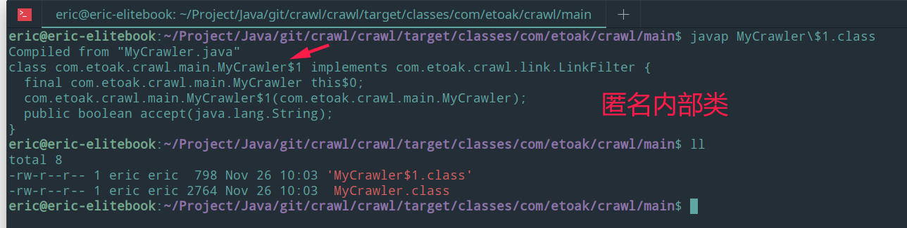
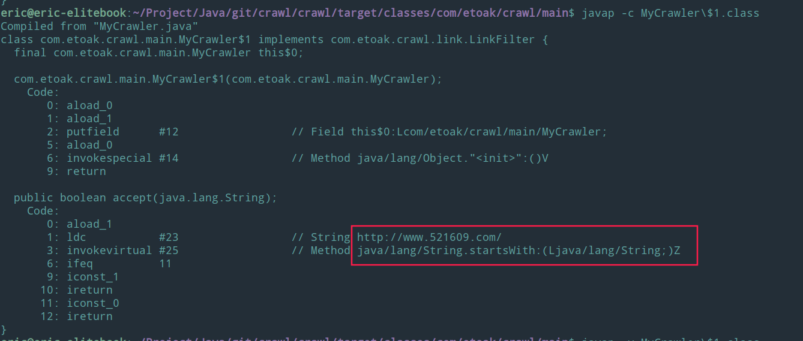
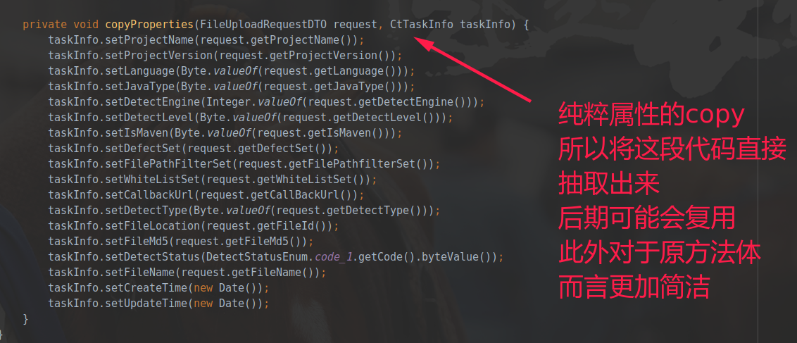

# Java

由于Java基础知识比较多，代码编写套路多，因此独立成一个md文件。
## 基础知识

### 程序入口

java除了main方法之外还有其他的程序入口。Java agent，premain，agentmain等。

###  volatile 

volatile关键字的主要作用就是保证变量的可见性然后还有一个作用是防止指令重排序。

把变量声明为volatile，这就指示 JVM，这个变量是不稳定的，每次使用它都到主存中进行读取。
## 数据结构

### HashMap

事实上这也是JDK8为什么要对HashMap进行链条冲突优化：当entry数量不少于64时，如果冲突链表长度达到8，就会将其转成红黑树。因为链表长度越长，性能会越来越差。HashMap最大capacity是2的30次方(1073741824)，最小为1，即使取了负数也会内部变成1.

HashMap有下面几个重要的属性：

1. 长度 length 或者大小 size ，缺省是16
2. 负载因子 loadFactor ，缺省是 0.75
3. 阈值 threshold = length * loadFactor   12= 16*0.75  也就是超过了12就会扩容，并不是达到16，用完了才扩容。
4.  扩容是变成原来的两倍，也就是左移1位。
5. HashMap的最大容量是2的30次方
6. HashMap是的key是不能重复的，如果有相同的key，最后一个key对应的value会把前一个相同的value覆盖掉。不是抛出异常

Hashtable不建议在新代码中使用，不需要线程安全的场合可以用HashMap替换，需要线程安全的场合可以用ConcurrentHashMap替换。

> 线程安全（多线程操作情况下） :arrow_forward: ConcurrentHashMap
>
> 线程不安全（单线程操作情况下）​ :arrow_forward: HashMap


HashMap最小处理逻辑单元Node 是一个静态内部类。可以看出来是一个链表结点。这也合理解释了底层使用红黑树。

```java
    static class Node<K,V> implements Map.Entry<K,V> {
        final int hash;
        final K key;
        V value;
        Node<K,V> next;

        Node(int hash, K key, V value, Node<K,V> next) {
            this.hash = hash;
            this.key = key;
            this.value = value;
            this.next = next;
        }

        public final K getKey()        { return key; }
        public final V getValue()      { return value; }
        public final String toString() { return key + "=" + value; }

        public final int hashCode() {
            return Objects.hashCode(key) ^ Objects.hashCode(value);
        }

        // 下面可以看出来会覆盖原来的值。并且返回原来的值。
        public final V setValue(V newValue) {
            V oldValue = value;
            value = newValue;
            return oldValue;
        }

        public final boolean equals(Object o) {
            if (o == this)
                return true;
            if (o instanceof Map.Entry) {
                Map.Entry<?,?> e = (Map.Entry<?,?>)o;
                if (Objects.equals(key, e.getKey()) &&
                    Objects.equals(value, e.getValue()))
                    return true;
            }
            return false;
        }
    }
```

上面代码可以看出来，新值会直接覆盖原值。

```java
     hashMap.put("key",1);
     // 返回旧值，可以从源代码中分析出来
     Integer key = hashMap.put("key", 11);
     System.out.println(key);
```


我们自定义HashMap初始容量大小时，构造函数并非直接把我们定义的数值当做HashMap容量大小，而是把该数值当做参数调用方法tableSizeFor，然后把返回值作为HashMap的初始容量大小：

```java
static final int tableSizeFor(int cap) {    
    int n = -1 >>> Integer.numberOfLeadingZeros(cap - 1);    
    return n < 0 ? 1 : (n >= 1073741824 ? 1073741824 : n + 1);
}
```

该方法会返回一个大于等于当前参数的2的倍数，因此HashMap中的table数组的容量大小总是2的倍数。

所以初始化大小的时候可以使用左移符号，例如  1<<10 也就是1024，1<<11 也就是2048。

```java
// the initial size is about 2048 
new HashMap(1<<11); 
```

参考：

[Java 8系列之重新认识HashMap](https://zhuanlan.zhihu.com/p/21673805)

[Java HashMap的扩容](https://www.cnblogs.com/KingIceMou/p/6976574.html)

[HashMap的最大容量为什么是2的30次方？](https://blog.csdn.net/qq_33666602/article/details/80139620)

[java移位运算符：<<（左移）、>>（带符号右移）和>>>（无符号右移）。](https://www.cnblogs.com/blog-cq/p/5793529.html)

[初步了解红黑树](https://blog.csdn.net/v_july_v/article/details/6105630)

### Vector

线程安全的数组，ArrayList与LinkList都是线程不安全的。

### 接口

java8之后interface可以允许有实现方法。

### FastList

https://blog.csdn.net/user_regist/article/details/80659970

https://blog.csdn.net/JYTXIOABAI/article/details/83827127

## github&gitee

1. [SSM基础框架](https://github.com/aohanhongzhi/ssm-basic)
    * maven
    * lombok
    * 参数验证
    * 拦截器
    * DTO
    * log4j2
    * druid
    * Mybatis
1. [SpringBoot框架](https://gitee.com/framework-collection/SpringBoot-Basic)
    * gradle
    * 全局异常处理
    * 多数据源->读写分离实战
    * DTO
    * logback-> 邮箱，多环境配置
    * druid
    * Mybatis
    * SpringSecurity，连接数据库查询，授权认证
1. [sparkjava+spring+rexdb](https://github.com/aohanhongzhi/SparkDemo)
1. [国产数据库ORM框架——rexdb](https://gitee.com/framework-collection/rexdb)
1. [Java核心研究](https://gitee.com/aohanhongzhi/ByteCode)
1. [Spring Framework](https://gitee.com/aohanhongzhi/spring-framework)
1. Dubbox
## JVM

需要掌握常用JVM调优技巧。

### Java常用命令

* javap -v  反编译出更加详细的字节码加载等过程
* javap -c  反编译出字节码

## 编码基础

### lombok

1. @Accessors(chain = true) 链式
    ```java
		// Bean上加注解
		@Accessors(chain = true)
	
		// bean 中的链式风格
		new User().setUserName(name).setPassword(password);
	```
    可能会导致ExceptionInInitializerError这种异常，程序无法启动等
### 接口与匿名内部类

这个程序里里面有一段代码
```java
    LinkFilter filter = new LinkFilter() {
            public boolean accept(String url) {
                if (url.startsWith("http://www.baidu.com/"))
                    return true;
                else
                    return false;
            }
        };
```

LinkFilter是一个接口
```java
public interface LinkFilter {
    public boolean accept(String url);
}
```

接口不能实例化，上面算什么操作？匿名？
> 反编译，结果就是匿名内部类



> 更加详细的反编译 

* javap -v
* javap -d

上面可以反编译出字节码，能从jvm层级理解java原理。



## 设计模式
设计模式是编码的一种前人总结的经验，并不是Java独有的。之所以放在Java里面，是因为后期可能多半使用Java语言来实现。毕竟这个设计模式的具体应用还是与语言有很大的关系的。

### 单例模式
单例模式有多种写法，饿汉式，饱汉式，静态内部类等。

#### 双重加锁的饿汉式
下面写法需要注意两个地方，一个是`volatile`关键字（防止指令重排，因为JVM会优化），一个是`synchronized (Singleton.class)`加锁。
```java
public class Singleton { 
    private volatile static Singleton uniqueInstance; 
    private Singleton() { } 
    public static Singleton getUniqueInstance() { 
        //先判断对象是否已经实例过，没有实例化过才进入加锁代码
         if (uniqueInstance == null) { 
             //类对象加锁 
             synchronized (Singleton.class) { 
                 if (uniqueInstance == null) { uniqueInstance = new Singleton(); 
                 } 
            } 
        } 
    return uniqueInstance; 
    } 
}
```
另外，需要注意 uniqueInstance 采用 volatile 关键字修饰也是很有必要。

uniqueInstance 采用 volatile 关键字修饰也是很有必要的， uniqueInstance = new Singleton(); 这段代码其实是分为三步执行：

为 uniqueInstance 分配内存空间
初始化 uniqueInstance
将 uniqueInstance 指向分配的内存地址
但是由于 JVM 具有指令重排的特性，执行顺序有可能变成 1->3->2。指令重排在单线程环境下不会出现问题，但是在多线程环境下会导致一个线程获得还没有初始化的实例。例如，线程 T1 执行了 1 和 3，此时 T2 调用 getUniqueInstance() 后发现 uniqueInstance 不为空，因此返回 uniqueInstance，但此时 uniqueInstance 还未被初始化。

使用 volatile 可以禁止 JVM 的指令重排，保证在多线程环境下也能正常运行。


来源: JavaGuide
文章作者: SnailClimb

文章链接: https://javaguide.cn/2019/12/09/java/java%E5%A4%9A%E7%BA%BF%E7%A8%8B/Java%20%E5%B9%B6%E5%8F%91%E8%BF%9B%E9%98%B6%E5%B8%B8%E8%A7%81%E9%9D%A2%E8%AF%95%E9%A2%98%E6%80%BB%E7%BB%93/#toc-heading-3

本文章著作权归作者所有，任何形式的转载都请注明出处。


### 工厂模式

直接上代码

```java
        package org.rex.db.datasource;
        import java.util.Properties;
        import javax.sql.DataSource;
        import org.rex.db.exception.DBException;
        import org.rex.db.logger.Logger;
        import org.rex.db.logger.LoggerFactory;
        import org.rex.db.util.DataSourceUtil;

        /**
        * DataSource factory.
        *
        * 抽象类，不可以实例化。
        * 
        * @version 1.0, 2016-02-14
        * @since Rexdb-1.0
        */
        public abstract class DataSourceFactory {
            
            private static final Logger LOGGER = LoggerFactory.getLogger(DataSourceFactory.class);
            
            private final Properties properties;
            
            private volatile DataSource dataSource;

            // TODO 不能实例化，那么构造器而定的public 参数等有啥意义？看到子类的super就知道了。这个可以用于super
            
            public DataSourceFactory(Properties properties) throws DBException{
                validateProperties(properties);
                this.properties = properties;
                
                if(LOGGER.isDebugEnabled())
                    LOGGER.debug("new datasource factory of properties {0} has been created.", DataSourceUtil.hiddenPassword(properties));
            }
            
            protected void validateProperties(Properties properties) throws DBException{
                if(properties == null || properties.size() == 0)
                    throw new DBException("DB-D0001");
            }
            
            public Properties getProperties() {
                return properties;
            }
            
            public synchronized DataSource getDataSource() throws DBException {
                if(dataSource == null) {
                    dataSource = createDataSource();
                    
                    LOGGER.info("new datasource[{0}] of datasource factory {1} has been created.", dataSource.hashCode(), DataSourceUtil.hiddenPassword(properties));
                }
                return dataSource;
            }
            
            public abstract DataSource createDataSource() throws DBException;
        }
```

从上面可以看出来这是一个抽象类，只有一个抽象方法`createDataSource()`。因为是抽象方法，没有具体的实现方式，只能交给子类来具体实现了，虽然是抽象方法，但是可以从`getDataSource()`中还是可以看到`createDataSource()`的使用。也就是说子类在实现`createDataSource()`的时候就可以调用父类的`getDataSource()`获取自己新建的东西了，之所以这么调用过来过去就是为了子类可以避免自己写很多乱七八糟的代码，工厂可以统一装配。

子类实现父类的构造器 super

```java
        package org.rex.db.datasource;

        import java.util.Properties;

        import javax.sql.DataSource;

        import org.rex.db.exception.DBException;

        /**
        * Simple DataSource Factory
        * 
        * @version 1.0, 2016-01-29
        * @since Rexdb-1.0
        */
        public class SimpleDataSourceFactory extends DataSourceFactory {
            
            public SimpleDataSourceFactory(Properties properties) throws DBException {
                // 这就是把父类(抽象类)实例化（实例化描述可能不太准确）
                super(properties);

            }

            @Override
            public DataSource createDataSource() throws DBException{
                return new SimpleDataSource(getProperties());
            }
        }


```

父类是不可以直接实例化的，但是子类正常，可以实例化。实例化之后直接调用父类的`getDataSource()`即可。 因为这个方法会去`createDataSource()`，而子类重写了这个方法。虽然感觉有点混乱，但是逻辑上还是很清晰的。


## 常用库

### guava

[总结一下guava常用并发库的用法](https://www.jianshu.com/p/b94a57bd5eb9)

### json库

#### fastjson
国内比较优秀的，性能更好。但是更加推荐使用jackson
#### jackson
SpringBoot默认的json中间件，更加规范

## 编码风格


1. Java的特点就是面向对象，因此应该全面使用对象概念。即从参数输入到输出到数据库等全过程阶段都应该是对象。参数输入使用如下方式。

```java
@GetMapping("/callback/detection_result")
public DetectionResultResponse detection_result(DetectionResultRequest request){
    DetectionResultResponse resultResponse= new DetectionResultResponse();

    detectFileUploadService.detectFileUpload(request);

    return resultResponse;
}
```

上面的`DetectionResultRequest`是封装的对象，也是前端传过来的参数集合。由于是对象操作，后期添加参数的时候改动也是最方便的，最简单的。

```java
package com.ctcc.misas.analysis_platform.request;

import lombok.Data;

@Data
public class DetectionResultRequest extends CommonRequest {

    private Integer taskId;
}
```

2. 对象之间信息拷贝



