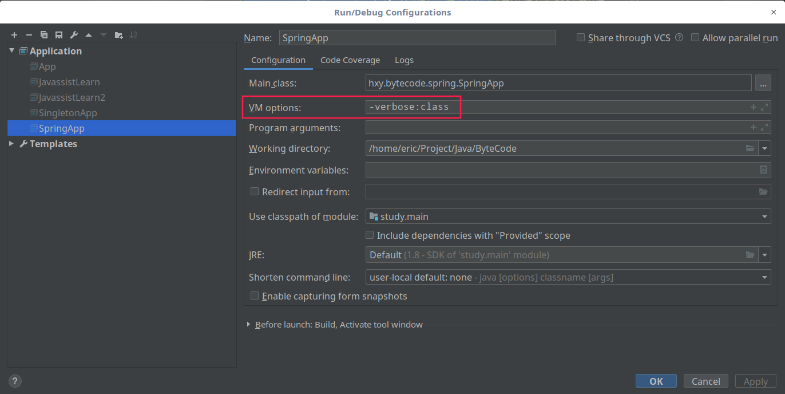
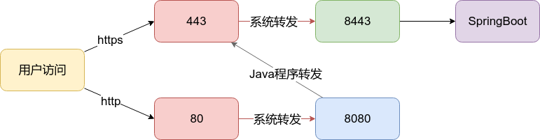

# 我学习过的知识

## 语言
1. Java
    * Spring
    * SpringBoot
    * SpringCloud
    * MyBatis
    * RexDB
    * Shiro
2. Python
    * flaskv
    * peewee
3. Go
    * beego
4. Kotlin
    * koti
5. JavaScript
    * nodejs

## Java

### jdk

1.  `-verbose:class`
    * jvm加载类的研究
    * 原文:https://www.ibm.com/developerworks/cn/java/j-dyn0429/
    * java直接使用

        ```java
        java -verbose:class com.test.Main
        ```

    * IDE中使用
    

1. 常用jvm调优
    ```
        /usr/local/eric/jdk1.8.0_211/bin/java -XX:MaxMetaspaceSize=256m -XX:+HeapDumpOnOutOfMemoryError -Xmx512m -Dfile.encoding=UTF-8 -Duser.country=US -Duser.language=en -Duser.variant -cp /home/eric/.gradle/wrapper/dists/gradle-5.2.1-bin/9lc4nzslqh3ep7ml2tp68fk8s/gradle-5.2.1/lib/gradle-launcher-5.2.1.jar org.gradle.launcher.daemon.bootstrap.GradleDaemon 5.2.1
    ```
    * `-XX:+HeapDumpOnOutOfMemoryError` 内存泄露的时候导出虚拟机的快照,可以保存后导出来看看那个怎么泄露的。工具jprofiler jvisualvm

### 基础

1. [IBM Java社区](https://www.ibm.com/developerworks/cn/java/)
1. [Java高级进阶](https://github.com/doocs/advanced-java)
1. `SimpleDataFormatter`是线程不安全的，`DateTimeFormatter`java8才有的线程安全获取时间格式。

    ```java
            LocalDateTime now = LocalDateTime.now();
            //java8才有的线程安全
            DateTimeFormatter dtf = DateTimeFormatter.ofPattern("yyyyMMddhhmmssSSS");
            String nowStr = now.format(dtf);
    ```
    从long unix时间戳格式化
    ```java

    package hxy.bytecode.date.time;

    import java.time.Instant;
    import java.time.LocalDateTime;
    import java.time.OffsetDateTime;
    import java.time.ZoneId;
    import java.time.ZoneOffset;
    import java.time.format.DateTimeFormatter;
    import java.util.Date;

    public class UnixTimeTest {
        public static void main(String[] args) {

            Date date = new Date(System.currentTimeMillis());
            Instant instant = date.toInstant();
            ZoneId zoneId = ZoneId.systemDefault();
             //    zoneId = TimeZone.getTimeZone("GMT+8:00").toZoneId();
            OffsetDateTime odt = OffsetDateTime.now(zoneId);
            ZoneOffset zoneOffset = odt.getOffset();
            LocalDateTime ldt = instant.atOffset(zoneOffset).toLocalDateTime();
    //        准确显示本地时间 2020-05-21 20:14:48  HH 大写是24小时制 hh 小写是12小时制
            DateTimeFormatter dtf = DateTimeFormatter.ofPattern("yyyy-MM-dd HH:mm:ss").withZone(zoneId);
            String startTimeStr = ldt.format(dtf);
            System.out.println(startTimeStr);

        }
    }

    ```

下面这个经过测试，时间使用的UTC，所以是格林尼治时间，如果想要显示本地时间参靠上面


    ```java
            Long startTime = Long.parseLong(ctEngineTask.getStartTime());
            Date date = new Date(startTime);
            Instant instant = date.toInstant();
            LocalDateTime ldt = instant.atOffset(ZoneOffset.UTC).toLocalDateTime();
            DateTimeFormatter dtf = DateTimeFormatter.ofPattern("yyyy--MM--dd HH:mm:ss");
            String nowStr = ldt.format(dtf);

    ```

    hh是12小时制 ("yyyy:MM:dd,hh:mm:ss") ，HH是24小时制 ("yyyy:MM:dd,HH:mm:ss") 


    ```java

            package com.ctcc.misas.util;
            import lombok.extern.slf4j.Slf4j;
            import java.time.Instant;
            import java.time.LocalDateTime;
            import java.time.ZoneId;
            import java.time.format.DateTimeFormatter;
            import java.util.TimeZone;

            /**
            * @author eric
            * @description:
            * @date 1/14/20 5:27 PM
                */
                @Slf4j
            public class DateTimeTest {
                    public static void main(String[] args) {
                    // createTime是Date类型，从数据库取出来的
                    //        Instant instant = createTime.toInstant();
                        Instant instant = Instant.now();
                        // 下面取得都是上海的值
                        ZoneId zoneId = ZoneId.systemDefault();
                        zoneId = TimeZone.getTimeZone("GMT+8:00").toZoneId();

                        LocalDateTime localDateTime = LocalDateTime.ofInstant(instant, zoneId);
                        //java8才有的线程安全
                        DateTimeFormatter dtf12 = DateTimeFormatter.ISO_LOCAL_DATE_TIME.ofPattern("yyyy/MM/dd hh:mm:ss").withZone(zoneId);
                    //        HH:mm:ss 大写是24小时
                        DateTimeFormatter dtf24 = DateTimeFormatter.ISO_LOCAL_DATE_TIME.ofPattern("yyyy/MM/dd HH:mm:ss").withZone(zoneId);
                        String nowStr = localDateTime.format(dtf12);
                        String nowStr24 = localDateTime.format(dtf24);
                        log.info("{}\n{}", nowStr, nowStr24);
                    }
            }

    ```
    DateTime.Now.ToString ("yyyy:MM:dd,hh:mm:ss") 12小时制转成24小时制


1. `org.apache.commons.lang3.StingUtils.isEmpty("String")`判断字符串是否为空
1. 不同浏览器，编码不一样的解决方案。

    ```java
    String userAgent = sRequest.getHeader("User-Agent");
            if(userAgent.contains("Firefox")) {
                this.filename = new String(reportName.getBytes(), "ISO8859-1");
            }else if(userAgent.contains("Chrome")) {
                String name =java.net.URLEncoder.encode(reportName, "UTF-8");
                name = name.replace("%28","(");
                name = name.replace("%29",")");
                this.filename =name;
            }else {
                this.filename = java.net.URLEncoder.encode(reportName, "UTF-8");
    ```

1. JDK多线程核心编程
    * 阿里巴巴建议自己手动新建线程指定核心线程数等参数。

    ```java
        // 阿里巴巴建议自己手动新建线程池，一定要指定最大线程数
        ExecutorService pool;
        pool = new ThreadPoolExecutor(5, 200,
                0L, TimeUnit.MILLISECONDS,
                new LinkedBlockingQueue<Runnable>(1024),Executors.defaultThreadFactory(), new ThreadPoolExecutor.AbortPolicy());
            pool.execute(new Runnable(){
                @Override
                public void run(){

                }
            })
        // 下面这种方式虽然简单，但是不够定制化，不推荐。原因是因为最大线程数指定为Integer.MAX_VALUE（可以视为无限大），会造成OOM
        ExecutorService exec = Executors.newCachedThreadPool();
        exec.execute(new Runnbale());
    ```
    下面是定时器的写法
    ```java

            ScheduledExecutorService scheduledExecutorService = new ScheduledThreadPoolExecutor(1, Executors.defaultThreadFactory());
            scheduledExecutorService.scheduleAtFixedRate(() -> {
                EdsLoginService.isLoginStatus();
            }, 10, 10, TimeUnit.MINUTES);

    ```
    线程池工作原理
    

1. 高并发网络编程
1. 性能调优实战
1. 定时器，阿里巴巴建议使用`java.util.concurrent.ScheduledExecutorService` 替换`java.util.Timer`

    ```java
    public class ScheduledExecutorServiceTest {
        public static void main(String[] args) {
            ScheduledExecutorService executorService = Executors.newSingleThreadScheduledExecutor();
            executorService.scheduleAtFixedRate(new Runnable() {
                @Override
                public void run() {
                    System.out.println("run "+ System.currentTimeMillis());
                }
            }, 0, 100, TimeUnit.MILLISECONDS);
            // Timer
            Timer timer= new Timer();
                timer.schedule(new TimerTask(){
                        @Override
                        public void run() {
                        }
                }, new Date(), 1000 * 60);
        }
    }
    ```


    ```
    
    * quartz分布式定时器

1. 异步改同步，线程加锁

1. 如果大概知道HashMap的大小，应该创建的时候就应该指定大小。

    ```java
        new HashMap<String,RSAKey>(2);
    ```

1. 各种Map
    1. HashMap
    1. ConcurrentHashMap
    1. LinkedHashMap
    1. TreeMap

### Spring

1. [Spring Boot要如何学习？](https://www.zhihu.com/question/53729800/answer/311948415)
1. [SpringBoot中文网](http://springboot.fun/)
1. SpringBoot的@EnableAsync， @Async注解使用及其原理
1. SpringBoot配置Redis查询缓存。三个注解。开启注解（@EnableCaching），使用注解，清除注解。重点在于key的自定义方式。
   
    * [SpringBoot下Redis模糊删除的AOP实现](https://docs.qq.com/doc/DSExjdkFka3VEWlR0)
1. ssl配置，iptable端口转发。

    
1. SpringBoot devtools热加载技术，开发的时候使用，至少html修改后刷新即可。devtools在线上模式自动屏蔽了，即java -jar启动方式。
1. [非WEB应用使用Spring控制反转与Bean注入](https://docs.qq.com/doc/DSEV2TWtPcGh5QXR3)

1. [使用SpringBoot构建普通非web的Java应用
](https://docs.qq.com/doc/DSHBVQ2pwQUVadFNk)
1. [SpringBoot的java全知识栈项目](https://github.com/longxiaonan/java-sea)
### MyCat

数据库中间件，多数据源，读写分离。主备切换。

### Mybatis

1. Mybatis-plus 通用性接口与jpa一样。[https://mybatis.plus/](https://mybatis.plus/)
1. pagehelper，分页插件

### logback

1. [logback.xml文件中配置javax.mail发送错误信息邮件](https://docs.qq.com/doc/DSFhiWENKWVJwa3B1)
1. logback-spring.xml,logback-test.xml,logback-dev.xml，日志随环境变量设置，目前仅仅测试于SpringBoot。

### log4j & log4j2

1. 配置文件名加2与不加2就足以分清版本，所以不可以随便加。
1. log4j配置方式学习log4j.properties

### rexdb

* 官网: http://db.rex-soft.org/
* gitee: https://gitee.com/rexsoft/rexdb

1. 一种国产的ORM框架，性能据官网介绍还不错。高效，简单灵活。体验之后确实感受与官方网站所介绍一样。有兴趣的可以看下源代码。
1. 支持分页加载。功能丰富，基本上ORM没有啥问题。简单易学。

### mail

1. java mail邮件发送，163邮件配置，ip被封杀查看，telnet 查看ip与port
1. logback.xml可以直接配置发送ERROR信息。

### security

1. java JWT掌握， **目前缓存没有配置成功** 。

### sparkjava

1. 一种轻量级，简单化的控制器框架。
对于一个小型的应用，快速搭建可以使用

应用层次 | 框架名 | 推荐理由
--- | --- | ---
前端交互|[Sparkjava](http://sparkjava.com/)| 更加简单的url-方法
服务层| [Spring-context](https://mvnrepository.com/artifact/org.springframework/spring-context)|控制翻转，Bean注入
ORM层| [rexdb](http://db.rex-soft.org/)|高效灵活简单
关系数据库|[postgresql](https://www.postgresql.org/)|开源自由

### Netty

1. 高性能的非阻塞网络框架
1. [心跳检测，SpringBoot中集成Netty的Sever与Client](https://gitee.com/aohanhongzhi/heart-netty)

### javafx

1. [java fx doc](https://docs.oracle.com/javase/8/javafx/api/index.html)
1. [利用JavaFx开发RIA桌面应用-布局说明](https://blog.csdn.net/loongshawn/article/details/52878527)
1. [JavaFX 教程 （中文）](https://code.makery.ch/zh-cn/library/javafx-tutorial/)
1. [易佰JavaFX教程](https://www.yiibai.com/javafx/javafx_path.html)

### java-di

注入框架
github: https://github.com/osglworks/java-di

### ActFramework

1. 官网:http://actframework.org/
1. [HelloWorld练习](https://github.com/act-gallery/helloworld)
1. act有自己的[注入框架](https://github.com/osglworks/java-di)，看起来要比Spring注入更加简单 参考：https://github.com/act-gallery/injection

---

## Python

### flask

1. python的flask使用gunicorn部署，docker应用部署python flask
2. flask 的MVC模型构建
3. yaml配置文件设置

### django

### Peewee

一个Python的轻量级ORM框架，确实很简易

1. [将CSV文件导入数据库](https://gitee.com/cctv-eric/peewee-python)
1. [安装指导](http://docs.peewee-orm.com/en/latest/peewee/installation.html)
1. [快速开始](https://www.jianshu.com/p/16d1c330810c)
1. [peewee用法考察](https://www.jianshu.com/p/182ea382b99f)
1. [指定数据库表的名字](https://www.osgeo.cn/peewee/peewee/models.html#creating-model-tables)

    ```python
    class UserProfile(Model):
    class Meta:
        table_name = 'user_profile_tbl'
    ```

### awesome-python

1. https://github.com/vinta/awesome-python
1. http://jobbole.github.io/awesome-python-cn/

### 优秀的库

#### 哪些 Python 库让你相见恨晚？

知乎：https://www.zhihu.com/question/24590883

#### pandas-profiling

一行代码分析数据

#### Playhouse

这个库可以很方便的将对象转成dict（json），[它里面的model_to_dict和dict_to_model两个方法](https://www.cnblogs.com/fnng/p/6879779.html)。

* [官方文档](http://docs.peewee-orm.com/en/latest/)
* [中文文档](https://www.osgeo.cn/peewee/index.html)

---

## Go

### beego

1. beego框架入门

### goframe

1. goframe新框架了解 https://goframe.org/

---

## MySql

### 性能调优

1. MySQL的掌握不能只会增删改查
1. MySQL查询性能分析

### MySQL Group Replication

https://www.jianshu.com/p/2ee012fe003f

1. 是组复制，不是同步复制，但最终是同步的，更确切地说，事务以相同顺序传递给所有组成员，但它们执行并不同步，接受事务被提交之后，每个成员以自己的速度提交。

### security

1. 防止暴力破解密码

### vault

1. 动态密码配置管理

---

## SQL

### 基础语句

1. 查询表总行数

```sql
SELECT Count(*) FROM schema.table;
```
1. 查询mysql版本
```sql
	select version();
```


2. 
---


## 虚拟容器

### docker

#### 基础使用

1. -m 参数可以用来调整dockerdocker容器内存限制。
   
    ```
    docker run -m 512m
    ```
1. -d 后台运行
1. docker stats 查看容器使用CPU 内存使用等信息

#### cluster

1. swam集群搭建配置与容器部署

#### registry

1. 阿里云docker仓库使用，本地推送镜像到云上，服务器拉取阿里云docker镜像部署

### Podman

Podman、Skopeo和Buildah下一代容器新架构强势出击！

官网：https://podman.io/

https://zhuanlan.zhihu.com/p/77373246

https://www.jianshu.com/p/56d66837d618


---

## Kubernetes

---

## Redis

1. redis的五种数据结构
    1. String 就是简单的键值对
    1. Hash就是多个String，即多个键值对
    1. List
    1. Set
    1. SortSet
1. SpringBoot配置redis缓存查询。
1. Redis集群部署（等待实践与理解）
1. Redis持久化方式(两种持久化方式)
    * 快照
    * Append of file
1. 一主二从三哨兵
> Sentinel（哨兵）可以监听集群中的服务器，并在主服务器进入下线状态时，自动从从服务器中选举处新的主服务器。
5. 分片是将数据划分为多个部分的方法，可以将数据存储到多台机器里面，这种方法在解决某些问题时可以获得线性级别的性能提升。
---

## Nginx

LVS负载均衡

---

## Kafka

分布式消息中间件

高吞吐

---

## RocketMQ

---

## Gradle

1. 依赖分析
    * `gradle dependencyInsight --dependency slf4j-api`
1. 强制依赖清除
    * `gradle build --refresh-dependencies`
<br/>请注意：--refresh 与 -dependencies 不应有空格存在，-dependencies 以参数形式依赖于 --refresh

---

## Groovy

### 基础联系

1. 在linux中以脚本执行  `./shellscript`

---

## Hadoop

1. hadoop是什么？
1. hadoop能搞什么？

## Security

1. [Hfish蜜罐](https://hfish.io/):https://gitee.com/lauix/HFish

## 通识

1. 代码中不要使用ip，因位ip会改变，最好使用域名。
1. 代码中不要使用绝对地址，存在安全性问题，此外也会造成数据库存储空间浪费。


## 经验

你真的优秀吗？

真不好意思，我取了一个这么无聊的标题。

国外流行一种编程方式，叫做结对编程，我相信国内很多公司都没有这么做，我就不在讲述结对编程带来的好处了，其实就是一边 code review，一边互相提高的一个过程。既然做不到这个，那如何让自己活在自己的世界中不断提高呢？

“平时开发的时候，做出的代码总认为是正确的，而且写法是完美的。”，我相信这是大部分人的心声，还回到刚刚的问题，如何在自己的世界中不断提高呢？

答案就是:

1. 多看成熟框架的源码

1. 多回头看自己的代码

1. 勤于重构

你真的优秀吗？如果你每周都完成了学习源码，回头看自己代码，然后勤于重构，我认为你就真的很优秀了。

即使也许你只是刚刚入门，但是一直坚持，你就是一个真的会写java代码的程序员了。