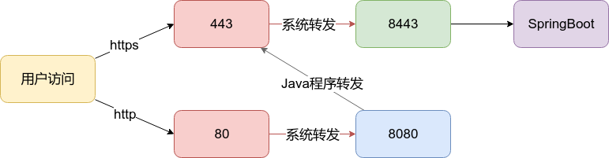

# 我学习过的知识

##  Java 

### 基础

1. `SimpleDataFormatter`是线程不安全的，`DateTimeFormatter`java8才有的线程安全获取时间格式。

### Spring

1. SpringBoot的@EnableAsync， @Async注解使用及其原理
1. SpringBoot配置Redis查询缓存。三个注解。开启注解（@EnableCaching），使用注解，清除注解。重点在于key的自定义方式。
    * [SpringBoot下Redis模糊删除的AOP实现](https://docs.qq.com/doc/DSExjdkFka3VEWlR0)
1. ssl配置，iptable端口转发。

    
1. SpringBoot devtools热加载技术，开发的时候使用，至少html修改后刷新即可。devtools在线上模式自动屏蔽了，即java -jar启动方式。
1. [非WEB应用使用Spring控制反转与Bean注入](https://docs.qq.com/doc/DSEV2TWtPcGh5QXR3)

1. [使用SpringBoot构建普通非web的Java应用
](https://docs.qq.com/doc/DSHBVQ2pwQUVadFNk)

### Mybatis

1. Mybatis-plus 通用性接口与jpa一样。[https://mybatis.plus/](https://mybatis.plus/)
1. pagehelper，分页插件

### logback

1. [logback.xml文件中配置javax.mail发送错误信息邮件](https://docs.qq.com/doc/DSFhiWENKWVJwa3B1)
1. logback-spring.xml,logback-test.xml,logback-dev.xml，日志随环境变量设置，目前仅仅测试于SpringBoot。

### rexdb

1. 一种国产的ORM框架，性能据官网介绍还不错。高效，简单灵活。体验之后确实感受与官方网站所介绍一样。有兴趣的可以看下源代码。
1. 支持分页加载。功能丰富，基本上ORM没有啥问题。简单易学。

### mail

1. java mail邮件发送，163邮件配置，ip被封杀查看，telnet 查看ip与port

### security

1. java JWT掌握， **目前缓存没有配置成功** 。

### sparkjava

1. 一种轻量级，简单化的控制器框架。
对于一个小型的应用，快速搭建可以使用

应用层次 | 框架名 | 推荐理由
--- | --- | ---
前端交互|[Sparkjava](http://sparkjava.com/)| 更加简单的url-方法
服务层| [Spring-context](https://mvnrepository.com/artifact/org.springframework/spring-context)|控制翻转，Bean注入
ORM层| [rexdb](http://db.rex-soft.org/)|高效灵活简单
关系数据库|[postgresql](https://www.postgresql.org/)|开源自由

### Netty

1. 高性能的非阻塞网络框架
1. [心跳检测，SpringBoot中集成Netty的Sever与Client](https://gitee.com/aohanhongzhi/heart-netty)

### javafx
1. [java fx doc](https://docs.oracle.com/javase/8/javafx/api/index.html)
1. [利用JavaFx开发RIA桌面应用-布局说明](https://blog.csdn.net/loongshawn/article/details/52878527)
1. [JavaFX 教程 （中文）](https://code.makery.ch/zh-cn/library/javafx-tutorial/)
1. [易佰JavaFX教程](https://www.yiibai.com/javafx/javafx_path.html)

### java-di

注入框架
github: https://github.com/osglworks/java-di

### ActFramework
1. 官网:http://actframework.org/
1. [HelloWorld](https://github.com/act-gallery/helloworld)
1. act有自己的[注入框架](https://github.com/osglworks/java-di)，看起来要比Spring注入更加简单 参考：https://github.com/act-gallery/injection

---

## Python

### flask

1. python的flask使用gunicorn部署，docker应用部署python flask
2. flask 的MVC模型构建
3. yaml配置文件设置

### django

---

## Go

### beego

1. beego框架入门

### goframe

1. goframe新框架了解 https://goframe.org/

---

## MySql

### security

1. 防止暴力破解密码

### vault

1. 动态密码配置管理

---

## Docker

### cluster

1. swam集群搭建配置与容器部署

### registry

1. 阿里云docker仓库使用，本地推送镜像到云上，服务器拉取阿里云docker镜像部署

---

## Redis

1. SpringBoot配置redis缓存查询。
1. Redis集群部署（等待实践与理解）
1. Redis持久化方式(等待理解)

---

## Gradle

1. 依赖分析
    * `gradle dependencyInsight --dependency slf4j-api`
1. 强制依赖清除
    * `gradle build --refresh-dependencies`
 请注意：--refresh 与 -dependencies 不应有空格存在，-dependencies 以参数形式依赖于 --refresh
---

## Groovy

### 基础

1. 在linux中以脚本执行  `./shellscript`

---

## Hadoop

1. hadoop是什么？
1. hadoop能搞什么？

## 通识

1. 代码中不要使用ip，因位ip会改变，最好使用域名。
1. 代码中不要使用绝对地址，存在安全性问题，此外也会造成数据库存储空间浪费。
