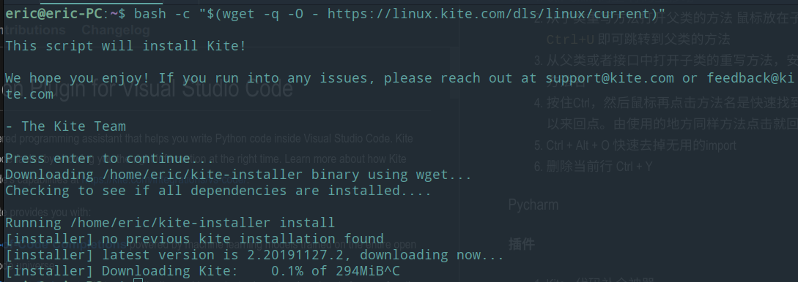

# Tool

1. [arthas](https://gitee.com/arthas/arthas) 阿里巴巴出品的虚拟机查看工具
1. [Rancher](https://www.rancher.cn/)是一个为DevOps团队提供的完整的Kubernetes与容器管理解决方案。它解决了多Kubernetes集群管理、操作和安全的难题，同时为DevOps团队提供了运行容器化工作负载的管理工具。
1. [visualvm](https://visualvm.github.io/
) java虚拟机程序运行情况
1. [Graal VisualVM](https://visualvm.github.io/graal.html)
1. 图床，可以免费存储图片
1. [Sourcetrail——代码结构流程分析软件，可以分析多种语言](https://github.com/CoatiSoftware/Sourcetrail/releases)
1. [Typora](https://typora.io/) 是一个非常好用的markdown编辑器，不需要使用者掌握markdown的语法，可以直接像编写word一样写出同样的文档。此外还有很多功能，例如导出PDF，HTML等各种文件。
1. Byteman 动态字节码工具，可以无渗透修改线上运行的代码

## software

### IDEA

#### 快捷键
1. Ctrl+Shift+向上 > 行向上移动
1. Ctrl+U  > 从子类重写方法打开父类的方法  鼠标放在子类的方法名中，按下 `Ctrl+U` 即可跳转到父类的方法
1. Ctrl +Alt+鼠标左击 父类的方法名  > 从父类或者接口中打开子类的重写方法，安装Ctrl +Alt+鼠标左击 父类的方法名
1. 按住Ctrl，然后鼠标再点击方法名是快速找到该方法被使用的地方。可以来回点。由使用的地方同样方法点击就回到了方法新建地方。
1. Ctrl + Alt + O  > 快速去掉无用的import
1. Ctrl + Y > 删除当前行 

### Pycharm

#### 插件
1. Kite - 代码补全神器
   * 下载地址：https://kite.com/download/
   * 支持Windows、Mac、Linux
   * 支持Atom、PyCharm、Sublime、VS Code、Vim、IntelliJ，更多语言正在扩展中。
   * 安装软件还是很大的294MB，说明确实有点东西，但是下载很慢。此外vsc可以直接在扩展找到安装。pycharm没有找到。
   

1.  zip -q -r -e ssh.zip .ssh/
