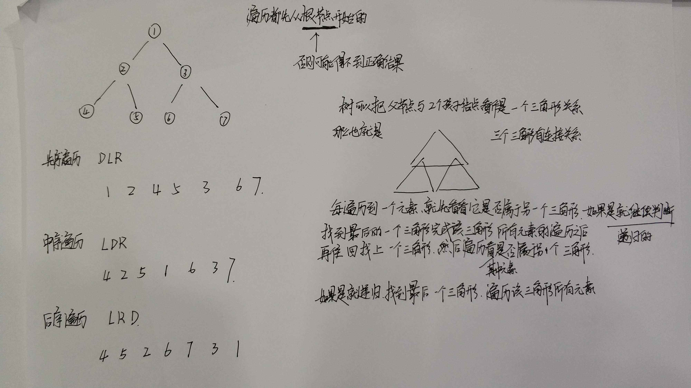

# ALGORITHM

## 强烈推荐的算法

1. https://osjobs.net/topk/all/
1. https://labuladong.gitbook.io/
1. https://github.com/TheAlgorithms/Python
1. https://github.com/TheAlgorithms/Java
1. https://github.com/TheAlgorithms/Go
1. https://github.com/yuanguangxin/LeetCode
1. https://programmercarl.com/

### LRU 内存淘汰算法

[漫画：什么是LRU算法？](https://zhuanlan.zhihu.com/p/52196637)

[自定义LRUSet解决OOM问题](https://www.jianshu.com/p/d7c3185dcb5f)

#### LRU 算法的实现中，采用尾插法更新还是头插法更新？

答案是：尾插法。

[通过分析LinkedHashMap了解LRU](https://www.jianshu.com/p/b8b00da28a49)

```
其实一提到LRU，我们就应该想到LinkedHashMap。LRU是通过双向链表来实现的。当某个位置的数据被命中，通过调整该数据的位置，将其移动至尾部。新插入的元素也是直接放入尾部(尾插法)。
这样一来，最近被命中的元素就向尾部移动，那么链表的头部就是最近最少使用的元素所在的位置。
```

因为头插法实际上会出现死循环的问题。一般是在HashMap7中会出现，这时候面试官就会问你为啥后面的8就不会了啊？


### 一致性Hash算法

在数据库分库分表的时候，使用hash取模的方式分表，那么后期数据迁移的时候，可能需要重新hash迁移数据，这时候就很麻烦了，如果使用一致性Hash算法就可以避免这个问题。在分片的时候这个数字尽量的大， 不然又要改分片逻辑又要改机器，此外这个数字
尽量使用2的倍数，如果看过hashmap的底层源码就会知道2的倍数处理起来会更加简单方便，不会那么复杂。

### 深度优先遍历

遍历都是先从根结点开始的。

1. 先序遍历
2. 中序遍历
3. 后续遍历



### 广度优先遍历

一层一层的来，所以称之为层次遍历。应该是最简单的遍历。无论是深度还是广度优先遍历都是从根结点开始的。


蛇形遍历

### 贪心算法

https://zhuanlan.zhihu.com/p/91254104

1. 找零钱问题（使用最少的硬币找零方式）

### 贪心区间

1. 最多的电影数
1. 最少箭头射爆最多的气球

### 动态规划

1. [爬楼梯问题](https://docs.qq.com/doc/DSEFEUEdYSHJVcG1t)
2. 迪杰斯特拉算法


### 布隆过滤器

去重

### 找平衡点

有一个全是整数（可能是负数）的一位数组，找出平衡点。
例如 [1,2,3,4,5] 平衡点就是4.两边的值最近。

> 解决提示: 暴力解开，然后再次优化即可。


1. [Java - - 判断表达式中的括号是否正确配对](https://blog.csdn.net/u011033906/article/details/53856692)