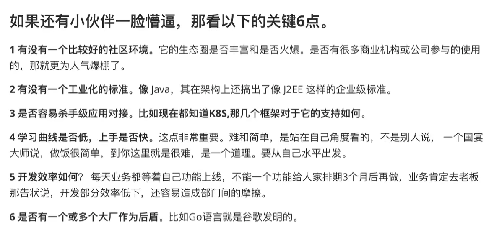

# ARCHITECTURE

## 微服务架构

微服务 = 分布式开发(业务部分) + 服务治理(管理调度)

### 微服务架构设计原则

架构分层有不同的方法论，常见有五六层。这里有四层的：

* 业务架构
* 逻辑架构
* 技术架构
* 基础架构

#### 业务架构

如果没有设计好产品的运营模式，技术实现再好，公司最后还是会倒闭的。对于中小型互联网公司而言，所有的技术经理和架构师都应该早早的介入这个层次的设计，对理解公司业务规划，以及反过来切合业务嘉兴架构设计都有好处。毕竟我们大多数人都是在为业务服务，难道不是吗？——《Docker微服务架构实战》

#### 逻辑架构

##### 聚合微服务设计模式

##### 代理微服务设计模式

##### 链式微服务设计模式

##### 分支微服务设计模式

#### 技术架构

很多程序员会认为技术架构就是SpringCloud，Dubbo这种框架。起始他们只是技术架构的子集。

技术架构还可以细分成 开发架构，运行架构，数据架构。

技术架构应该包括以下几点：

1. 服务治理框架
1. 各种开源框架的二次开发与封装
1. 代码开发规范,GitFlow
1. 代码检查和热编译
1. 模块化，分层，Maven规范和治理，也就是项目构建工具的管理，不限于maven，还有gradle等
1. 各种定制的中间件
1. 数据表的设计，数据库优化
1. 数据逻辑库的拆分 

#### 基础架构

基础架构的参与者是运维工程师、网络工程师、架构师。

基础架构包含物理机、网络、机架、防火墙、交换机、WAP、磁盘阵列。

#### 微服务交付流程

使用微服务架构开发应用程序，我们实际上是针对一个个微服务进行设计、开发、测试、部署，因为每个服务之间是没有彼此依赖的，也就是每一个应用都是并行开发。

在设计阶段，架构师将产品功能拆分成若干服务，为每一个服务设计API接口（例如RESTAPI），需要给出API文档，包括API的名称、版本、请求参数、响应结果、错误代码等信息。

## 企业开发技术

### 关于RPC和HTTP的选型区别。

一般来说小型企业，比较适合使用http的，大型企业适合RPC的。协议上RPC可能更加高效一点，但是http比较适合哪种信息孤岛的现象，就像电信集团有很多子公司，大家各自为政，但是又得互相融合。这时候就比较适合使用http通信了。就不需要有统一的注册中心来注册RPC的服务。

### 框架

https://github.com/mfornos/awesome-microservices

#### zebra

Zebra 是国信证券的微服务框架，是国信证券在微服务架构和 CNCF 上的实践，让有相同目标方向的尽量少走弯路

https://gitee.com/gszebra/zebra

### 网络通信协议

#### smart-socket

https://gitee.com/smartboot/smart-socket

### web容器

#### Tomcat

#### Undertow

#### Netty

#### Jetty

#### smart-http

https://gitee.com/smartboot/smart-http

### 容器

#### k8s

#### Docker

容器化部署，智能运维，几万个节点的部署。
https://yeasy.gitbooks.io/docker_practice/

[Jib无痛构建Docker镜像不影响第二天上班](https://docs.qq.com/doc/DSHlZdWZ5dVhiZ0NW)

#### Rancher

容器编排工具

<https://www.rancher.cn/>

### 服务注册与发现

分布式系统中有一个非常著名的CAP定理，C表示数据一致性，A表示服务可用性，P表示服务对网络分区故障的容错性。这三个特性在任何分布式系统中都不能同时满足，最多只能满足两个。本质上ZooKeeper是一个CP实现，而Eureka是一个AP实现。

CAP关注的粒度是数据，而不是整个系统。CAP不是针对一个整个系统而言的，而是针对部分而言的。一个系统里面，不同的模块是允许采用不同的组合。

例如一个电商系统的财务部分需要使用CP，而里面的物流部分只要是AP即可。

#### ZooKeeper

非常优秀的服务发现与注册中间件。由于其CP实现形式，被一大批生态软件采用。

#### SpringCloud Eureka

AP实现，采用Peer2Peer对等通信方式，去中心化的方式，无Master/Slaver区分，每一个Peer都是对等的。

Eureka作为服务发现与注册中心，即使整个Eureka集群宕机，消费者还是可以通过自己之前的缓存获取注册表的！也就是每一个消费者并不是简单的获取自己想要的信息，而是所有信息。这也就解释了服务端的负载均衡与Eureka端的负载均衡。因为都是有完整的注册表的（缓存，即使Eureka宕机，也是可以的），所以知道怎么负载均衡！

Eureka的一个缺点就是可视化的面板几乎没有任何管理操作，例如上下线等。只有查看的功能。

 **总结**

    Zookeeper基于CP，不保证高可用性，如果ZooKeeper正在进行Master选举，或者Zookeeper集群中超过半数以上的机器不可用，那么将无法获得数据。Eureka基于AP，能保证高可用性，即使所有机器都出现故障，也能获取本地缓存的数据。
    
    作为注册中心，其实配置是不经常变动的，只有应用发布和机器出现故障时才会变动。对于不经常变动的配置来说，CP是不合适的，而AP在遇到问题时可以用牺牲一致性来保证高可用性，即使返回旧数据，缓存数据。
    
    因为Dubbo推荐ZooKeeper，因此国内大量的服务都用ZooKeeper来实现服务发现，但是从分布式理论上来看，Eureka更适合用作注册中心的。
    
    ——《Docker微服务架构实战》

#### Consul

分布式协同工具，Spring cloud Consul。Consul是一个服务网格（微服务间的 TCP/IP，负责服务之间的网络调用、限流、熔断和监控）解决方案，它是一个一个分布式的，高度可用的系统，而且开发使用都很简便。它提供了一个功能齐全的控制平面，主要特点是：服务发现、健康检查、键值存储、安全服务通信、多数据中心。

https://spring.io/projects/spring-cloud-consul

<https://www.jianshu.com/p/7d20dc58c9fc>

#### Nacos

https://nacos.io/zh-cn/

一个更易于构建云原生应用的动态服务发现、配置管理和服务管理平台。说白了就是相当于eureka+Apollo，这个是阿里巴巴开源的，使用的公司还是很多的（国内居多，因为有幺蛾子表示Eureka2.+胎死腹中，存在闭源风险。然而这种下一版本停止的太多了）。

登录首页
http://localhost:8848/nacos/index.html#/login
默认的用户名和密码都是nacos

#### Etcd

https://github.com/etcd-io/etcd

### 日志

#### ELK

构建统一的日志分析处理平台。可以做很多的事。数据分析等

#### 链路分析 minbox-logging

https://gitee.com/minbox-projects/minbox-logging

### tlog

https://gitee.com/dromara/TLog

tlog | 轻量级的分布式日志标记追踪神器 | http://bryan31.gitee.io/tlog-website/

### plumelog

https://gitee.com/frankchenlong/plumelog

一个java分布式日志系统，支持百亿级别，日志从搜集到查询，不用去文件中翻阅日志方便快捷，支持查询一个调用链的日志，支持链路追踪，查看调用链耗时情况，在分布式系统中也可以查询关联日志，能够帮助快速定位问题，简单易用，没有代码入侵，查询界面友好，高效，方便，只要你是java系统，不要做任何项目改造，接入直接使用，日志不落本地磁盘，无需关心日志占用应用服务器磁盘问题

### sofa-tracer

SOFATracer 是一个用于分布式系统调用跟踪的组件，通过统一的 traceId 将调用链路中的各种网络调用情况以日志的方式记录下来，以达到透视化网络调用的目的。这些日志可用于故障的快速发现，服务治理等。

https://gitee.com/sofastack/sofa-tracer

### 监控

#### Cat

CAT 是基于 Java 开发的实时应用监控平台，为美团点评提供了全面的实时监控告警服务。

最大的亮点就是不用在海量的日志里找错误了，直接从cat打点里看报错，非常简单易用，能大大提高错误排查效率。

https://github.com/dianping/cat

#### Cubic

一站式问题分析解决平台

https://cubic.jiagoujishu.com/

#### WGCLOUD

https://www.wgstart.com/

https://gitee.com/wanghouhou/wgcloud

#### 夜莺

Nightingale是一套衍生自Open-Falcon的互联网监控解决方案，融入了滴滴的最佳实践，由于改动太大，优化太多，产品上已经无法与Open-Falcon平滑兼容，故而单开一个项目。

https://n9e.didiyun.com/

https://github.com/didi/nightingale

####  JavaMonitor

https://github.com/onblog/JavaMonitor

<http://n9e.didiyun.com/>

#### bistoury

Bistoury是去哪儿网的java应用生产问题诊断工具，提供了一站式的问题诊断方案

https://github.com/qunarcorp/bistoury

### 运维

http://ansible.com.cn/docs/intro.html

#### 流量录制

录制线上流量请求，然后回放。

https://github.com/buger/goreplay/

> https://blog.csdn.net/CleverCode/article/details/101423570

timeout 60 gor --input-raw :80 --output-file basepost.gor

timeout 60 gor --input-raw :8000 --output-file /Data/logs/gor/basepost.gor > /dev/null 2>&1 &

#### log-pilot

#### taillog

http://www.taillog.cn/

#### Splunk

#### Zabbix

用的应该也比较多

<https://www.zabbix.org.cn/>

参考：<https://www.cnblogs.com/clsn/p/7885990.html>

### 配置中心

在功能架构上，一个优秀的配置中心应该包括以下功能点。

* 高可用
* 高容错
* 提供管理界面
* 多维度配置
* 灰度配置
* 权限/审计/审查
* 低侵入式接入
* 易维护
* 安全

> [配置中心有一个非常好的应用就是开关编程](https://mp.weixin.qq.com/s/0oPvo1GwzO4O45iRKLsfUA)

#### Apollo (推荐)
[Apollo](https://github.com/ctripcorp/apollo/wiki)（阿波罗）是携程框架部门研发的 **分布式配置中心** ，能够集中化管理应用不同环境、不同集群的配置，配置修改后能够实时推送到应用端，并且具备规范的权限、流程治理等特性，适用于微服务配置管理场景。

服务端基于Spring Boot和Spring Cloud开发，打包后可以直接运行，不需要额外安装Tomcat等应用容器。

Java客户端不依赖任何框架，能够运行于所有Java运行时环境，同时对Spring/Spring Boot环境也有额外支持。

> 在日常编码中，可以使用配置中心来弄一个Boolean变量作为新旧功能的开关。一旦上线的功能有问题，可以修改下配置及时解决服务问题。

#### Spring Cloud Config + Git (小型系统推荐)
没有管理界面

#### 其他的配置中心

https://gitee.com/sxfad/config-keeper
https://gitee.com/xuxueli0323/xxl-conf

### 消息中间件

#### RabbitMQ

集群部署并不是很好，处理消息在万级别

#### kafka

高吞吐，累积多

#### RocketMQ

### 事务管理中间件

#### Seata
分布式事务中间件

https://www.oschina.net/p/seata

#### Hmily

Hmily是一款高性能，零侵入，金融级分布式事务解决方案，目前主要提供柔性事务的支持，包含 `TCC`, `TAC`(自动生成回滚SQL) 方案，未来还会支持 `XA` 等方案。

https://dromara.org/projects/hmily/overview/

#### Raincat

强一致性分布式事务，是基于二阶段提交+本地事务补偿机制来实现。

https://dromara.org/zh/projects/raincat/overview/

### 分布式文件存储

#### FastDFS
https://gitee.com/fastdfs100/fastdfs

### 数据库

#### 数据库相关中间件

##### id生成器 

分布式id

https://gitee.com/didiopensource/tinyid
     
不建议使用uuid这种无序的来生成id，会导致数据库的索引重排序，浪费数据库的性能。

###### 美团的分布式id

https://github.com/Meituan-Dianping/Leaf

https://tech.meituan.com/2017/04/21/mt-leaf.html

##### 分布式MySQL工具集Vitess

> 官网 https://vitess.io/

outube出品的开源分布式MySQL工具集Vitess，自动分片存储MySQL数据表，将单个SQL查询改写为分布式发送到多个MySQL Server上，支持行缓存（比MySQL本身缓存效率高），支持复制容错，已用于Youtube生产环境

#### MySQL

目前8.+，性能是5.7的两倍，而且增加了很多新特性。MySQL有很多的版本，如果集群部署的话，可以考虑使用cluster版本。可以参考mycat中间件。

阿里巴巴 MySQL binlog 增量订阅&消费组件 数据同步

https://github.com/alibaba/canal

#### MariaDB

mysql被Oracle收购之后，原班人马基于MySQL开源分之，开发了新的完全兼容MySQL的分支。一旦MySQL闭源。可以用MariaDB来替代。

#### Postgresql 

优秀的开源数据库，据说这个数据更加现代化，比mysql更好。

#### TiDB
 开源分布式 NewSQL 关系型数据库（兼容MySQL协议）

https://pingcap.com/index.html

#### TBase

https://www.oschina.net/p/tbase

https://github.com/Tencent/TBase

 是腾讯数据平台团队在开源的 PostgreSQL 基础上研发的企业级分布式 HTAP 数据库管理系统：

具备高性能可扩展的分布式事务能力，支持 RC 和 RR 两种隔离级别；

通过安全、管理、审计三权分立体系，提供全方位的数据安全保证机制；

支持高性能分区表，可使得数据检索效率成倍提升；

SQL 方面兼容 2003 标准、PostgreSQL 语法和常用 Oracle 函数&数据类型、窗口函数等；

提供大小商户数据分离、冷热数据分离等高效的数据治理能力

### NoSql数据库

#### Redis

Redis-shake是一个用于在两个redis之间同步数据的工具，满足用户非常灵活的同步、迁移需求。
https://github.com/alibaba/RedisShake

[卧槽！牛皮了，他居然把大厂常问的Redis面试题的答案都写下来了！](https://www.jianshu.com/p/de78aead9d9b)

#### Tair

https://github.com/alibaba/tair

> 美团基于Tair开发了Cellar。

#### MongoDB

https://github.com/alibaba/MongoShake

### 文件存储

#### 小文件存储

https://gitee.com/suzhou-mopdila-information/ruyuan-dfs

### 大数据

#### mdrill

1. https://github.com/alibaba/mdrill

#### Apache Doris

Apache Doris是一个现代化的MPP分析型数据库产品。仅需亚秒级响应时间即可获得查询结果，有效地支持实时数据分析。Apache Doris的分布式架构非常简洁，易于运维，并且可以支持10PB以上的超大数据集。

http://doris.apache.org/master/zh-CN/

### 认证和授权框架

#### SpringSecurity

#### SA-Token

功能上要比SpringSecurity更加丰富，使用上也是更加简单。推荐使用。

http://sa-token.dev33.cn/

https://gitee.com/dromara/sa-token

https://github.com/dromara/sa-token

#### sureness

https://dromara.org/sureness/zh-cn/

#### jap

https://gitee.com/fujieid/jap

### 网关API

[一个简单可参考的API网关架构设计](https://www.cnblogs.com/kaleidoscope/p/9648004.html)

#### apisix

目前国内比较流行。

https://gitee.com/iresty/apisix/

#### OpenResty 

基于Nginx与Lua的高性能网关，性能稳定，API丰富。

https://openresty.org/en/

https://github.com/openresty/

美团基于这个开发了一个 Oceanus 是面向美团 TPU 序列所有同学的 HTTP 服务治理平台及七层负载均衡网关服务。
Oceanus 服务治理致力于提供统一的自动化、智能化路由的解决方案，支持服务注册与发现、动态负载均衡、可视化管理、定制化路由、Session复用、熔断降级、一键截流和性能统计等功能。

#### SpringGateway(Zuul)

SpringCloud家族，智能网关。性能不输Nginx。Zuul的核心是一系列的Filter。

####  Shenyu (原Soul)

现在是Apache的顶级项目了。

https://shenyu.apache.org/

https://github.com/apache/incubator-shenyu

JAVA语言中高性能，可插拔，响应式API网关

#### Kong

kong是nginx和lua的集成版本，应该功能和插件非常丰富。

##### konga

kong的管理界面

https://github.com/pantsel/konga

##### kongx

https://gitee.com/raoxy/kongx

##### 插件

https://gitee.com/raoxy/kong-plugins-canary

#### Nginx

单线程高性能网关。nignx可以在一次访问请求状态为500的时候，直接访问另一台服务器。做到热迁，参考 https://blog.csdn.net/wy0123/article/details/88551915

#### tengine

http://tengine.taobao.org/

#### HAProxy

HAProxy是一个免费的负载均衡软件，可以运行于大部分主流的Linux操作系统上。

HAProxy提供了L4(TCP)和L7(HTTP)两种负载均衡能力，具备丰富的功能。HAProxy的社区非常活跃，版本更新快速（最新稳定版1.7.2于2017/01/13推出）。最关键的是，HAProxy具备媲美商用负载均衡器的性能和稳定性。

因为HAProxy的上述优点，它当前不仅仅是免费负载均衡软件的首选，更几乎成为了唯一选择。

作者：kelgon
链接：https://www.jianshu.com/p/c9f6d55288c0
来源：简书
著作权归作者所有。商业转载请联系作者获得授权，非商业转载请注明出处。

### 分布式技术栈

#### Sentinel

Sentinel是阿里巴巴开源的限流器熔断器，并且带有可视化操作界面。功能比较简单使用,但是满足特定场景还是需要定制化开发.非高并发的项目,可能达不到系统负载的限额,那么这种流量防护并没有什么实际意义.

#### 分布式锁

https://blog.csdn.net/qq_42046105/article/details/111350721

#### 如何设计一个分布式锁

https://blog.csdn.net/s751167520/article/details/107399410
https://www.cnblogs.com/caijindou/p/13226539.html

### 批处理

#### SpringBatch

https://blog.csdn.net/topdeveloperr/article/details/84337956

### 代码审查

#### sonarqube

可以使用这个做代码审查，做到bugfree。代码质量会影响后期的运行，内存溢出等等。

#### 阿里巴巴规范插件

### 项目构建工具

#### Gradle

地表最强的项目构建工具，不接受任何反驳

#### Maven

1. 生成doc文档 `mvn javadoc:javadoc`

#### Buildr

### 系统管理工具

#### 进程服务管理

用作守护进程，保证设备底层服务的正常运行

[有点类似nohup的作用，但是功能更加强大。](https://www.jianshu.com/p/0b9054b33db3)
http://supervisord.org/

---
## Java技术栈

### ORM中间件

框架名 | 说明 | 官网
--- | --- | ---
mybatis |半自动化的ORM，灵活性更高 | 
mybatis-plus| mybatis的增强，全自动化。既有hibernate，jpa的自动化又有mybatis的灵活性 |https://mybatis.plus/
rexdb| 手写sql，https://gitee.com/rexsoft/rexdb |http://db.rex-soft.org/
hibernate | 全自动化 |
J2Cache | Java 两级缓存框架，可以让应用支持两级缓存框架 ehcache(Caffeine) + redis 。避免完全使用独立缓存系统所带来的网络IO开销问题 |<https://gitee.com/ld/J2Cache>
加密运行jar包 | Spring Boot JAR 安全加密运行工具，同时支持的原生JAR。 基于对JAR包内资源的加密以及拓展ClassLoader来构建的一套程序加密启动，动态解密运行的方案，避免源码泄露或反编译。 |<https://gitee.com/core-lib/xjar>
kisso | java 基于 Cookie 的 SSO 中间件 kisso |<https://gitee.com/baomidou/kisso>
jpa|SpringBoot常用的，个人体验不是很好 |
anima|blade框架作者杰作，无需sql | https://github.com/biezhi/anima
BeetlSQL|全功能DAO工具， 同时具有Hibernate 优点 & Mybatis优点功能，适用于承认以SQL为中心，同时又需求工具能自动能生成大量常用的SQL的应用。 <https://gitee.com/xiandafu/beetlsql> | <http://ibeetl.com/> 
memory | 超轻量级 Java 持久化工具 | https://gitee.com/bitprince/memory
weed3 | | https://gitee.com/noear/weed3 
liteBatch | 一个超轻量级，高性能的快速批插工具，可以和mybatis，hibernate任何orm框架结合使用| https://gitee.com/bryan31/liteBatch

个人推荐使用**mybatis-plus**比较好，既可以使用注解，也可以使用xml文件配置，还可以直接继承BaseMapper接口。Service实现ServiceImpl等类，Model也可以直接操作。灵活也不失自动化。

### 常用中间件

框架名 | 说明 | 官网
--- | --- | ---
Lombok | 简化对象封装（打包可以排除）| [https://github.com/rzwitserloot/lombok](https://github.com/rzwitserloot/lombok)
Redis|缓存| [https://redis.io/](https://redis.io/)
Caffeine|本地缓存，应用内存| <http://www.mydlq.club/article/56/> 
JWT | JWT登录支持 | [https://github.com/jwtk/jjwt](https://github.com/jwtk/jjwt)
MongoDb | NoSql数据库 | [https://www.mongodb.com/](https://www.mongodb.com/)
Docker | 应用容器引擎 | [https://www.docker.com/](https://www.docker.com/)
Druid | 数据库连接池 | [https://github.com/alibaba/druid](https://github.com/alibaba/druid)
HikariCP|SpringBoot2.+默认数据库连接池，性能非常优秀 | https://github.com/brettwooldridge/HikariCP
oh-my-email|Java 邮件发送库了，支持抄送、附件、模板 | <https://github.com/biezhi/oh-my-email> 
RabbitMq | 消息队列 | [https://www.rabbitmq.com/](https://www.rabbitmq.com/)
sso |java 基于 Cookie 的 SSO 中间件 kisso | [https://gitee.com/baomidou/kisso](https://gitee.com/baomidou/kisso)
okhttps| 基于okhttp封装 | https://gitee.com/ejlchina-zhxu/okhttps
forest|  更轻量、更简单实用的HTTP客户端框架 | https://gitee.com/dromara/forest
验证码 | 基于 SpringBoot Google Kaptcha 验证码 快速启动器 |<https://gitee.com/baomidou/kaptcha-spring-boot-starter>
tlog | 轻量级的分布式日志标记追踪神器 | http://bryan31.gitee.io/tlog-website/
aspect-log | 能给你的每条日志打上自定义业务标签，方便进行日志的分析和寻错| https://gitee.com/bryan31/aspect-log
mzt-biz-log |一个注解，搞定 SpringBoot 操作日志 | https://github.com/mouzt/mzt-biz-log
redisson|redisson分布式锁实现 | https://github.com/redisson/redisson/
joda-time | 时间处理 | https://www.joda.org/joda-time/
hotkey | 毫秒级探测热点数据，毫秒级推送至服务器集群内存，大幅降低热key对数据层查询压力 |https://gitee.com/jd-platform-opensource/hotkey
sureness | 面向REST API的高性能认证鉴权框架，致力于管理保护API安全 | https://gitee.com/dromara/sureness
sa-token | 可能是史上功能最全的Java权限认证框架 | https://gitee.com/dromara/sa-token
image-combiner| 一个专门用于Java服务端图片合成的工具 | https://gitee.com/dromara/image-combiner
zip4j | 压缩文件处理 | https://github.com/srikanth-lingala/zip4j
---

### 企业级应用开发技术栈

技术 | 说明 | 官网
----|----|----
Spring Boot | JavaBean容器 | [https://spring.io/projects/spring-boot](https://spring.io/projects/spring-boot)
SpringWeb | MVC框架 |
Spring Security | 认证和授权框架 | [https://spring.io/projects/spring-security](https://spring.io/projects/spring-security)
Shiro |授权与认证 |
MyBatis | ORM框架  | [http://www.mybatis.org/mybatis-3/zh/index.html](http://www.mybatis.org/mybatis-3/zh/index.html)
MyBatis-plus | ORM框架增强  | [https://mybatis.plus/](https://mybatis.plus/)
MyBatisGenerator | 数据层代码生成 | [http://www.mybatis.org/generator/index.html](http://www.mybatis.org/generator/index.html)
PageHelper | MyBatis物理分页插件 | [http://git.oschina.net/free/Mybatis_PageHelper](http://git.oschina.net/free/Mybatis_PageHelper)
Swagger-UI | 文档生产工具 | [https://github.com/swagger-api/swagger-ui](https://github.com/swagger-api/swagger-ui)
Hibernator-Validator | 验证框架 | [http://hibernate.org/validator/](http://hibernate.org/validator/)
Elasticsearch | 搜索引擎，毫秒级 | [https://github.com/elastic/elasticsearch](https://github.com/elastic/elasticsearch)
RabbitMQ | 消息队列 | [https://www.rabbitmq.com/](https://www.rabbitmq.com/)
Redis | 分布式缓存 | [https://redis.io/](https://redis.io/)
MongoDb | NoSql数据库，日志文档存储 | [https://www.mongodb.com/](https://www.mongodb.com/)
Docker | 应用容器引擎 | [https://www.docker.com/](https://www.docker.com/)
jib | Java应用打包成Docker镜像 | https://github.com/GoogleContainerTools/jib
Druid | 数据库连接池 | [https://github.com/alibaba/druid](https://github.com/alibaba/druid)
OSS | 对象存储 | [https://github.com/aliyun/aliyun-oss-java-sdk](https://github.com/aliyun/aliyun-oss-java-sdk)
JWT | JWT登录支持 | [https://github.com/jwtk/jjwt](https://github.com/jwtk/jjwt)
LogStash | 日志收集 | [https://github.com/logstash/logstash-logback-encoder](https://github.com/logstash/logstash-logback-encoder)
Lombok | 简化对象封装工具 | [https://github.com/rzwitserloot/lombok](https://github.com/rzwitserloot/lombok)
rsa-encrypt|Spring Boot 接口请求参数自动加解密 |https://gitee.com/catch_wind/rsa-encrypt-body-spring-boot
easy-excel|阿里巴巴excel处理工具 | https://alibaba-easyexcel.github.io/
captcha|行为验证码|https://gitee.com/anji-plus/captcha 
SpringBoot Google Kaptcha | 简单快速集成 Google Kaptcha验证码 | https://gitee.com/baomidou/kaptcha-spring-boot-starter
Discovery| 全链路灰度路由 ,灰度发布 | https://gitee.com/nepxion/Discovery
Sentinel | 面向分布式服务架构的高可用流量防护组件 | https://github.com/alibaba/Sentinel
Rate Limiter | google的限速器 | https://docs.qq.com/doc/DSElXRFZsVUdCbWZB
 ratelimiter-spring-boot-starter | 注解封装版本  | https://gitee.com/kailing/ratelimiter-spring-boot-starter
tinyid | 分布式id生成器 |https://gitee.com/didiopensource/tinyid
shardingsphere | 分布式数据库解决方案 | https://shardingsphere.apache.org/index_zh.html
Koala （Golang）| 通用频率控制规则引擎系统 | https://github.com/heiyeluren/koala
asyncTool | 多线程排列组合框架 | https://gitee.com/jd-platform-opensource/asyncTool
liteFlow | 轻量，快速，稳定，可编排的组件式流程引擎 | https://gitee.com/dromara/liteFlow
Spring-Retry | 重试 |https://github.com/spring-projects/spring-retry
easy-retry| 一种存储介质可扩展的持久化重试方案  | https://github.com/alibaba/easy-retry
amon |	一个注解解决方法级限流难题 | 	https://gitee.com/lyhome_admin/amon
 mykit-delay |  延迟消息队列框架 | https://github.com/sunshinelyz/mykit-delay
 testable-mock| 单元测试框架 | http://freyrlin.gitee.io/testable-mock/#/
---

### SpringCloud家族

基于Restful的微服务框架。

##### 主角应用

主角应用一般是自己作为server独立存在。

组件 | 说明 | 官网
---|---|---
Eureka|服务注册与发现中心 | 
Admin|应用监控| https://github.com/codecentric/spring-boot-admin
Zuul|网关|
Zipkin| 链路数据分析组件，Sleuth收集信息 |

##### 配角应用

配角应用一般是集成在其他组件里面，不能独立成为一个Server。

组件 | 说明 | 官网
---|---|---
Feign|服务之间的调用|
Ribbon|负载均衡，大多数 组件都默认集成了|
HyStrix|熔断降级|
Sleuth|信息收集，将信息发送给Zipkin|

##### 专业应用
组件 | 说明 | 官网
---|---|---
SpringCloudRabbitMQ|RabbitMQ客户端 |
SpringCloudRedis| Redis客户端|
SpringCloudMongoDB| MongoDB客户端|

SpringCloud Config不建议使用，可以使用携程的Apollo替代。

Spring家族官网：https://spring.io/

SpringCloud官网：https://spring.io/projects/spring-cloud

据了解SpringCloud官网提供了80多种中间件集成的starter。

##### 等待研究的中间件

框架 | 说明 | 官网
----|----|----
SpringBoot | JavaBean容器| [https://spring.io/projects/spring-boot](https://spring.io/projects/spring-boot)
Spring Vault | 数据库动态密码管理，敏感配置信息管理，需要安装vault。 | https://spring.io/projects/spring-vault
Vault |动态密码Server |https://www.hashicorp.com/products/vault/
spring-boot-starter-jersey |Restful Web服务，类似SpringMVC |https://blog.csdn.net/github_38395241/article/details/70265379
Consul | 注册中心,建议放弃使用,企业版受美国法律限制|https://spring.io/projects/spring-cloud-consul
Nacos | 阿里开源的注册中心 | https://nacos.io/
smart-framework | 基础原理学习 | https://gitee.com/huangyong/smart-framework
Takin | 全链路压测 | https://github.com/shulieTech/Takin
---

### Dubbox + ZooKeeper

基于RPC的微服务框架，适合大型企业的开发。这个框架的社区活跃度和生态并不是很好，建议一般还是使用SpringCloud生态体系比较好。

1. 接口需要做鉴权
2. 服务面向接口 Service和ServiceImpl不能写在同一个包里面。因为Service的包api是作为服务依赖被业务方使用。所以是分离的。

### RPC 框架

#### koalas-rpc

漂亮团内部的一个大佬 张玉龙(zhangyulong04)的个人自研框架。有空可以好好研究下。

https://gitee.com/dromara/koalas-rpc

---
### Micronaut新一代的微服务框架

https://micronaut.io/

* Grails团队新宠；
* 可以用 Java、Groovy 和 Kotlin 编写的基于微服务的应用程序；
* 相比Spring Boot已经比较全面；
* 性能较优，编码方式与Spring Boot比较类似；
* 启动时间和内存消耗方面比其他框架更高效；
* 多语言；
* 依赖注入；
* 内置多种云本地功能；
* 很新，刚发布1.0.0

---

### 技术栈1

对于一个小型的应用，快速搭建可以使用。[sparkjava+spring+rexdb](https://github.com/aohanhongzhi/SparkDemo)

应用层次 | 框架名 | 推荐理由
--- | --- | ---
前端交互|[Sparkjava](http://sparkjava.com/)| 更加简单的url-方法
服务层| [Spring-context](https://mvnrepository.com/artifact/org.springframework/spring-context)|控制翻转，Bean注入
ORM层| [rexdb](http://db.rex-soft.org/)|高效灵活简单
关系数据库|[postgresql](https://www.postgresql.org/)|开源自由

---

### 技术栈2

应用层次 | 框架名 | 推荐理由
--- | --- | ---
前端与服务|[balde](https://github.com/lets-blade/blade)| 与SpringBoot类似的路由方式与控制翻转和依赖注入
ORM | [blade-anima](https://github.com/biezhi/anima)| 无需手写sql，直接方法操作数据库

### JMagician

https://github.com/JMagician

官方文档：
https://magician-io.com/

和[Blade](https://github.com/lets-blade/blade)差不多一个水平，也许更加优秀，社区活跃度比较高。也是国人开发的。

这个框架还有一个Golang的版本。

https://beeruscc.com/
https://github.com/yuyenews/Beerus

### Solon

感觉和[Blade](https://github.com/lets-blade/blade)一个水平，相对来说比较完善。

https://gitee.com/noear/solon

### oxygen

和blade有点类似，比较小而全面。

https://gitee.com/justlive1/oxygen

### JODD

感觉还挺完善的，但是看起来比blade复杂啊。blade更像SpringBoot。

https://jodd.org/

### javalin

https://javalin.io/

A simple web framework for Java and Kotlin

## Python

### flask

flask

中文文档：

<http://docs.jinkan.org/docs/flask/>

英文文档：

<https://flask.palletsprojects.com/>

学习视频

https://www.bilibili.com/video/BV18441117Hd

### FastAPI

官网 https://fastapi.tiangolo.com/zh

非常优秀的框架，采用携程性能可以与Go比肩。实际使用的时候，发现集成peewee的时候发现这个与controller接口的时候有问题，不能使用同一个类对象来处理参数反序列化和数据库存储。所以很麻烦。 **不建议使用**

## 如何选择一门语言或者框架

## 测试

MeterSphere 是一站式开源持续测试平台，涵盖测试跟踪、接口测试、性能测试、团队协作等功能，兼容JMeter 等开源标准，有效助力开发和测试团队充分利用云弹性进行高度可扩展的自动化测试，加速高质量软件的交付。

MeterSphere 的功能

测试跟踪: 远超 TestLink 的使用体验，覆盖从编写用例到生成测试报告的完整流程；
接口测试: 集 Postman 的易用与 JMeter 的灵活于一体，接口管理、接口 Mock、多协议支持、场景自动化，你想要的全都有；
性能测试: 兼容 JMeter，支持 Kubernetes 和云环境，轻松支持高并发、分布式的性能测试；
团队协作: 用户管理、租户管理、权限管理、资源管理，无论团队规模如何，总有适合的落地方式。
MeterSphere 的优势

开源：基于开源、兼容开源；按月发布新版本、日均下载安装超过100次、被大量客户验证；
一站式：一个产品全面涵盖测试跟踪、接口测试、性能测试等功能并形成联动：其中用例管理是底座需求、接口自动化测试是高频需求、性能测试是专家服务为主工具为辅；一个产品全满足从测试计划、测试执行到测试报告分析的全生命周期需求；
持续测试：能将测试融入持续交付和 DevOps 体系；无缝对接 Bug 管理工具和持续集成工具等；支持团队协作和资产沉淀。

https://github.com/metersphere/metersphere

## 优秀的github总结

1. [java核心知识库](https://github.com/crossoverJie/JCSprout)
2. [Java学习+面试指南](https://github.com/Snailclimb/JavaGuide)
3. [Spring Boot 教程、技术栈示例代码](https://github.com/ityouknow/spring-boot-examples)
4. [秒杀系统设计与实现](https://github.com/qiurunze123/miaosha)
5. [大数据入门指南](https://github.com/heibaiying/BigData-Notes)
6. [programmer-advancement](https://github.com/Snailclimb/programmer-advancement)