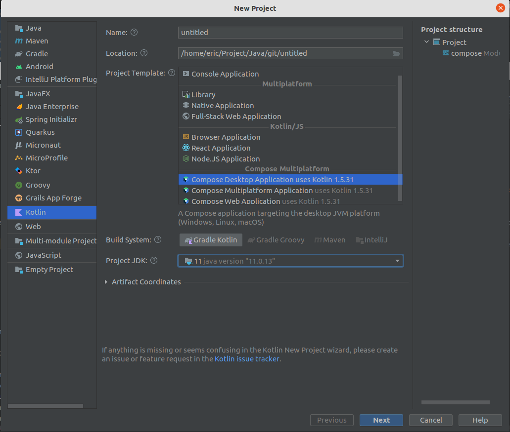

GUI程序开发
===========

# C++

## C++和QT

直接打包，不需要任何的额外的运行库。

https://gitee.com/aohanhongzhi/cpp-qt-study

https://gitee.com/aohanhongzhi/clion-cpp-qt

# Java

## Javafx

需要jre，但是jdk11之后打包可以生成平台原生的库，体积大大减小。

javafx支持Java，Kotlin和Groory编写。

https://gitee.com/lilixiaoyi/javafx-demo

# Kotlin

## Compose for Desktop

jetpack compose 应该是kotlin编写的，可能java也是可以的。

# Python

## PYQT

https://github.com/pyqt

PYQT商用貌似是要购买的。

# Flutter

# Go

## wails

https://wails.io/
