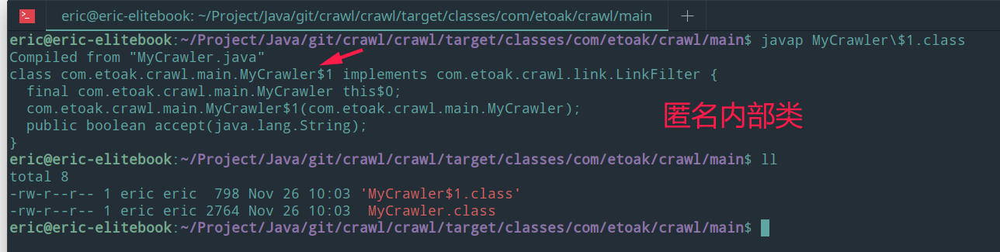
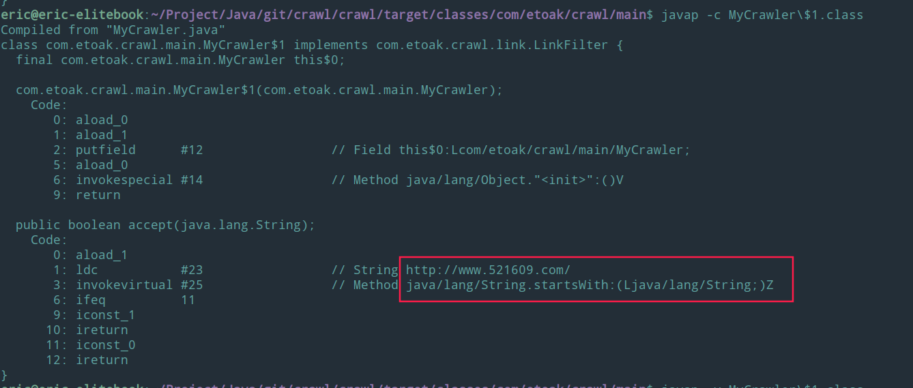
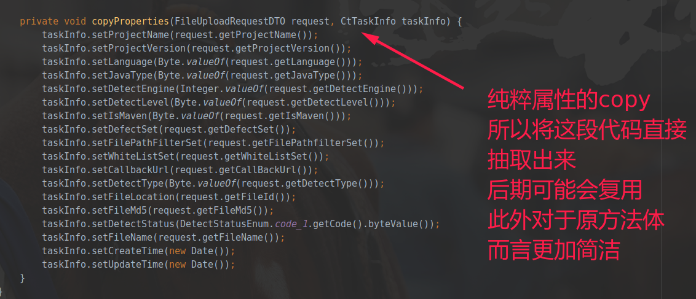

# Java

由于Java基础知识比较多，代码编写套路多，因此独立成一个md文件。

1. https://github.com/zhonghuasheng/Tutorial

## 基础知识

[你写的Java对象究竟占多少内存？](https://mp.weixin.qq.com/s/RJrfOO4ruSrBzU7V5LDI9g)

1. 元注解

[元注解@Retention确定注解的周期](https://blog.csdn.net/u010002184/article/details/79166478) 

典型的作用就是有些注解其实编译之后或者运行的时候已经去掉了。例如lombok等注解一般编译之后就没有了。swagger注解一般运行期可能就没有了，所以并不影响代码性能。

### 程序入口

java除了main方法之外还有其他的程序入口。Java agent，premain，agentmain等。

###  volatile 

volatile关键字的主要作用就是保证变量的可见性然后还有一个作用是防止指令重排序。

把变量声明为volatile，这就指示 JVM，这个变量是不稳定的，每次使用它都到主存中进行读取。

能不能保证一致性？为啥不能？

### synchronized

https://www.cnblogs.com/three-fighter/p/14396208.html


## 数据结构

### Object

[重写hashcode和equals方法](https://blog.csdn.net/u012557538/article/details/89861552)

### HashMap

事实上这也是JDK8为什么要对HashMap进行链条冲突优化：当entry数量不少于64时，如果冲突链表长度达到8，就会将其转成红黑树。因为链表长度越长，性能会越来越差。HashMap最大capacity是2的30次方(1073741824)，最小为1，即使取了负数也会内部变成1.

HashMap有下面几个重要的属性：

> [HashMap中capacity、loadFactor、threshold、size等概念的解释](https://blog.csdn.net/fan2012huan/article/details/51087722)

1. capacity就是指HashMap中桶的数量，实际上就是数组长度。缺省值为16。

    ```
        /**
        * The default initial capacity - MUST be a power of two.
        */
        static final int DEFAULT_INITIAL_CAPACITY = 1 << 4; // aka 16
    ```

    > 这只是一个概念，HashMap中没有这个成员变量，有相关的局部变量。
     
    在resize()方法中有old Capacity概念。

    ```
         int oldCap = (oldTab == null) ? 0 : oldTab.length;
    ```

1. Return index for hash code has
    ```
    static int indexFor(int h,int length){
        // 本质上就是取余，取得数组的下标
        return h & (length - 1);
    }
    ```
    上面的length必然是2的倍数，否则下面的解释不通。

    ```
      15          0000 1111
      hashCode    1011 0101
    ```

    前面的变化对于取余后的数都没有变化，只有后面4位决定了取余后的值(0-15)，后面4位就是取余的一种最快方式，但是仅限特定的取余数。

2. 负载因子 loadFactor ，缺省是 0.75

3. 阈值 threshold = length * loadFactor   12= 16*0.75  也就是超过了12就会扩容，并不是达到16，用完了才扩容。

4. 扩容是变成原来的两倍，也就是左移1位。

5. HashMap的最大容量是2的30次方
   1. ```java 
        // 最大容量（必须是2的幂且小于2的30次方，传入容量过大将被这个值替换）
        static final int MAXIMUM_CAPACITY = 1 << 30;
      ```
      
    2. 为什么是30？而不是31？

    答： 首先：JAVA规定了该static final 类型的静态变量为int类型，至于为什么不是byte、long等类型，原因是由于考虑到HashMap的性能问题而作的折中处理！

    由于int类型限制了该变量的长度为4个字节共32个二进制位，按理说可以向左移动31位即2的31次幂。但是事实上由于二进制数字中最高的一位也就是最左边的一位是符号位，用来表示正负之分（0为正，1为负），所以只能向左移动30位，而不能移动到处在最高位的符号位！
    补充：按照我自己的理解选择30估计是出于性能折中处理，因为int的最大值是2的31次方减1.也就是1<<31-1，最小负数就是负的2的31次方。
    3. [HashMap的最大容量为什么是2的30次方(1左移30)?](https://blog.csdn.net/sayWhat_sayHello/article/details/83120324)
    4. [HashMap 容量和最大索引取值表](https://blog.csdn.net/feleon/article/details/92721045)

6. HashMap是的key是不能重复的，如果有相同的key，最后一个key对应的value会把前一个相同的value覆盖掉。不是抛出异常

7. 在并发环境下使用 `HashMap` 容易出现死循环。

   并发场景发生扩容，调用 `resize()` 方法里的 `rehash()` 时，容易出现环形链表。这样当获取一个不存在的 `key` 时，计算出的 `index` 正好是环形链表的下标时就会出现死循环。

   > 所以 HashMap 只能在单线程中使用，并且尽量的预设容量，尽可能的减少扩容。

   在 `JDK1.8` 中对 `HashMap` 进行了优化： 当 `hash` 碰撞之后写入链表的长度超过了阈值(默认为8)并且 `table` 的长度不小于64(否则扩容一次)时，链表将会转换为**红黑树**。

   假设 `hash` 冲突非常严重，一个数组后面接了很长的链表，此时重新的时间复杂度就是 `O(n)` 。

   如果是红黑树，时间复杂度就是 `O(logn)` 。

   大大提高了查询效率。

Hashtable不建议在新代码中使用，不需要线程安全的场合可以用HashMap替换，需要线程安全的场合可以用ConcurrentHashMap替换。

> 线程安全（多线程操作情况下） :arrow_forward: ConcurrentHashMap
>
> 线程不安全（单线程操作情况下）​ :arrow_forward: HashMap


HashMap最小处理逻辑单元Node 是一个静态内部类。可以看出来是一个链表结点。这也合理解释了底层使用红黑树。

```java
    static class Node<K,V> implements Map.Entry<K,V> {
        final int hash;
        final K key;
        V value;
        Node<K,V> next;

        Node(int hash, K key, V value, Node<K,V> next) {
            this.hash = hash;
            this.key = key;
            this.value = value;
            this.next = next;
        }

        public final K getKey()        { return key; }
        public final V getValue()      { return value; }
        public final String toString() { return key + "=" + value; }

        public final int hashCode() {
            return Objects.hashCode(key) ^ Objects.hashCode(value);
        }

        // 下面可以看出来会覆盖原来的值。并且返回原来的值。
        public final V setValue(V newValue) {
            V oldValue = value;
            value = newValue;
            return oldValue;
        }

        public final boolean equals(Object o) {
            if (o == this)
                return true;
            if (o instanceof Map.Entry) {
                Map.Entry<?,?> e = (Map.Entry<?,?>)o;
                if (Objects.equals(key, e.getKey()) &&
                    Objects.equals(value, e.getValue()))
                    return true;
            }
            return false;
        }
    }
```

上面代码可以看出来，新值会直接覆盖原值。

```java
     hashMap.put("key",1);
     // 返回旧值，可以从源代码中分析出来
     Integer value = hashMap.put("key", 11);
     System.out.println(value);
```


我们自定义HashMap初始容量大小时，构造函数并非直接把我们定义的数值当做HashMap容量大小，而是把该数值当做参数调用方法tableSizeFor，然后把返回值作为HashMap的初始容量大小：

```java
static final int tableSizeFor(int cap) {    
    int n = -1 >>> Integer.numberOfLeadingZeros(cap - 1);    
    return n < 0 ? 1 : (n >= 1073741824 ? 1073741824 : n + 1);
}
```

该方法会返回一个大于等于当前参数的2的倍数，因此HashMap中的table数组的容量大小总是2的倍数。

所以初始化大小的时候可以使用左移符号，例如  1<<10 也就是1024，1<<11 也就是2048。

```java
// the initial size is about 2048 
new HashMap(1<<11); 
```

9. [hashMap数据统计应用](https://blog.csdn.net/u010938610/article/details/82622144) 

参考：

[Java 8系列之重新认识HashMap](https://zhuanlan.zhihu.com/p/21673805)

[Java HashMap的扩容](https://www.cnblogs.com/KingIceMou/p/6976574.html)

[HashMap的最大容量为什么是2的30次方？](https://blog.csdn.net/qq_33666602/article/details/80139620)

[java移位运算符：<<（左移）、>>（带符号右移）和>>>（无符号右移）。](https://www.cnblogs.com/blog-cq/p/5793529.html)

[初步了解红黑树](https://blog.csdn.net/v_july_v/article/details/6105630)

### LinkedHashMap

1. [自定义LRUSet解决OOM问题](https://www.jianshu.com/p/d7c3185dcb5f)

1. 为啥

### ConcurrentHashMap


### List

ArrayList和LinkedList的增加需要看情况而定。最好还是熟悉源代码，从源代码中来了解原因。前者需要扩容，后者新建对象。所以两者都会有自己的耗时。

#### ArrayList

查询的情况下，ArrayList还是占优势。

[Java ConcurrentModificationException异常原因和解决方法](https://docs.qq.com/doc/DSFhQdkhLeFZyQlhh)

[ArrayList为什么会出现并发问题以及相应的解决办法](https://blog.csdn.net/seujava_er/article/details/89963639)


#### LinkedList

遍历的时候不要使用for循环去get，建议用iterator来遍历下。


#### CopyOnWriteArrayList

#### 

### Stream


[list多个字段进行去重以及过滤](https://blog.csdn.net/qq_30667039/article/details/102386480)

```java
public static void main(String[] args) {
    us u=fa.fa(1);
    us u2=fa.fa(1);
    us u3=fa.fa(1);
    List<us> list=new ArrayList<>();
    u.setAge(10);
    u.setName("张三");
    list.add(u);
    u2.setAge(13);
    u2.setName("李四");
    list.add(u2);
    u3.setAge(13);
    u3.setName("李四");
    list.add(u3);
    List<us> usList=list.stream().collect(Collectors.collectingAndThen(Collectors.toCollection(()->new TreeSet<>(Comparator.comparing(s->s.getName()+";"+s.getAge()))),ArrayList::new));
    usList.forEach(userList->{
    System.out.println(userList.getName()+userList.getAge());
    });
}

```


将list转成map。并且遍历map。

```java
// 将list转成map        
Map<Integer, String> map = list.stream().collect(
                Collectors.toMap(Student::getAge, Student::getName, (key1, key2) -> key1)
        );
// map遍历        
map.forEach((key, value) -> {
            System.out.println("key: " + key + "    value: " + value);
        });


List<CtUserDefineDefectSet> ctUserDefineDefectSets = ctUserDefineDefectSetMapper.selectList(queryWrapper);

Map<Integer, CtUserDefineDefectSet> collect = ctUserDefineDefectSets.stream().collect(Collectors.toMap(CtUserDefineDefectSet::getSecondGradeId, ctUserDefineDefectSet -> ctUserDefineDefectSet, (key1, key2) -> key1));


```

List转Set

```java
   Set<String> collect = teamAppModelList.stream().map(dto -> dto.getAppId()).collect(Collectors.toSet());
```
#### 收集某个元素
```
new ContentVideoCoverDTO()
               
List<ContentVideoCoverDTO> contentVideoCoverDTOS = contentVideoCoverFuture.get();
               
List<Long> videoCoverPicIds = contentVideoCoverDTOS.stream().map(ContentVideoCoverDTO::getContentId).collect(Collectors.toList());

```
filter之后再次map，把int值转成long
```
          List<Long> addTagIds = subStatusCodes.stream()
                    .filter(tagId -> tagId != null && !finalExistTag.contains(tagId.longValue()))
                    .map(Integer::longValue)
                    .collect(Collectors.toList());
```

#### 统计符合条件的


#### List去重

java 8 stream、lambda表达式对list操作分组、过滤、求和、最值、排序、去重

1.分组

通过groupingBy分组指定字段

list.stream().collect(Collectors.groupingBy(User::getSex));

2.过滤

通过filter方法过滤某些条件

list.stream().filter(a -> !a.getJobNumber().equals("201901")).collect(Collectors.toList());

3.求和

基本类型:先mapToInt，然后调用sum方法

List.stream().mapToInt(User::getAge).sum();

大数类型:reduce调用BigDecimal::add方法

List.stream().map(User::getFamilyMemberQuantity).reduce(BigDecimal.ZERO, BigDecimal::add);

4.最值

最大值

List.stream().map(User::getEntryDate).max(Date::compareTo).get();

最小值

List.stream().map(User::getEntryDate).min(Date::compareTo).get();

5.排序

list.stream().sorted((o1, o2)->o1.getItem().getValue().

compareTo(o2.getItem().getValue())).

collect(Collectors.toList());

sort()

单字段排序，根据id排序list.sort(Comparator.comparing(Obj::getItem));

多字段排序，根据id，年龄排序list.sort(Comparator.comparing(Obj::getItem).thenComparing(Obj::getItem));

6.去重

通过distinct方法

List.stream().distinct().collect(Collectors.toList());

对属性

重写方法

7.获取list某个字段组装新list

List.stream().map(a -> a.getId()).collect(Collectors.toList());
————————————————
版权声明：本文为CSDN博主「长尾裙」的原创文章，遵循CC 4.0 BY-SA版权协议，转载请附上原文出处链接及本声明。
原文链接：https://blog.csdn.net/weixin_36040777/article/details/112884759


### Java8两个集合(List)取交集、并集、差集、去重并集

```java
import java.util.ArrayList;
import java.util.List;

import static java.util.stream.Collectors.toList;

/**
 * @author ming
 * @version 1.0.0
 * @date 2020/6/17 14:44
 **/
public class CollectionsTest {
    public static void main(String[] args) {
        List<String> list1 = new ArrayList<>();
        list1.add("1");
        list1.add("2");
        list1.add("3");
        list1.add("4");
        list1.add("5");

        List<String> list2 = new ArrayList<>();
        list2.add("2");
        list2.add("3");
        list2.add("6");
        list2.add("7");

        // 交集
        List<String> intersection = list1.stream().filter(item -> list2.contains(item)).collect(toList());
        System.out.println("---交集 intersection---");
        intersection.parallelStream().forEach(System.out::println);

        // 差集 (list1 - list2)
        List<String> reduce1 = list1.stream().filter(item -> !list2.contains(item)).collect(toList());
        System.out.println("---差集 reduce1 (list1 - list2)---");
        reduce1.parallelStream().forEach(System.out::println);

        // 差集 (list2 - list1)
        List<String> reduce2 = list2.stream().filter(item -> !list1.contains(item)).collect(toList());
        System.out.println("---差集 reduce2 (list2 - list1)---");
        reduce2.parallelStream().forEach(System.out::println);

        // 并集
        List<String> listAll = list1.parallelStream().collect(toList());
        List<String> listAll2 = list2.parallelStream().collect(toList());
        listAll.addAll(listAll2);
        System.out.println("---并集 listAll---");
        listAll.parallelStream().forEachOrdered(System.out::println);

        // 去重并集
        List<String> listAllDistinct = listAll.stream().distinct().collect(toList());
        System.out.println("---得到去重并集 listAllDistinct---");
        listAllDistinct.parallelStream().forEachOrdered(System.out::println);

    }

}
```

### Vector

线程安全的数组，ArrayList与LinkList都是线程不安全的。

### JUC 

#### CountDownLatch

https://www.jianshu.com/p/e233bb37d2e6

https://www.jianshu.com/p/7c7a5df5bda6?ref=myread


#### CyclicBarrier


#### Callable

1. [FutureTask 会 “吞掉“ 异常是怎么回事？需要注意些什么？](https://blog.csdn.net/u014240299/article/details/108849457)
 > 实际开发中一脸懵逼，抛出了异常，指示出来是NPE，但是不知道爆发点在哪里。NPE异常经过了封装，失去了原本地方。


### 接口

java8之后interface可以允许有实现方法。接口一般不能实例化，有一种编程思想叫，面向接口编程，是为了解耦。典型就是SSM框架或者Spring框架中就是这种思想。但是实例化还是由implement的类来实例化的，只不过类型是接口类型。也就是相当于子类具体实现，但是成为父类的类型。

### FastList

https://blog.csdn.net/user_regist/article/details/80659970

https://blog.csdn.net/JYTXIOABAI/article/details/83827127


## github&gitee

1. [SSM基础框架](https://github.com/aohanhongzhi/ssm-basic)
    * maven
    * lombok
    * 参数验证
    * 拦截器
    * DTO
    * log4j2
    * druid
    * Mybatis
1. [SpringBoot框架](https://gitee.com/framework-collection/SpringBoot-Basic)
    * gradle
    * 全局异常处理
    * 多数据源->读写分离实战
    * DTO
    * logback-> 邮箱，多环境配置
    * druid
    * Mybatis
    * SpringSecurity，连接数据库查询，授权认证
    * [SpringBoot教程](https://github.com/forezp/SpringBootLearning)
1. [sparkjava+spring+rexdb](https://github.com/aohanhongzhi/SparkDemo)
1. [国产数据库ORM框架——rexdb](https://gitee.com/framework-collection/rexdb)
1. [Java核心研究](https://gitee.com/aohanhongzhi/ByteCode)
1. [Spring Framework](https://gitee.com/aohanhongzhi/spring-framework)
1. Dubbox
1. [blade framework](https://lets-blade.com/)
1. [javalin](https://javalin.io/):https://github.com/aohanhongzhi/JavalinDemo
1. [jfast](https://gitee.com/zhuimengshaonian/jfast)
## JVM

需要掌握常用JVM调优技巧。

### Java的锁

锁与JVM规范没啥关系，所以每个JDK版本可能都不一样。

### 逃逸分析

[【腾讯文档】JVM之逃逸分析](https://docs.qq.com/doc/DSE1VVHhUcURyaVVk) 

> 逃逸分析对锁是有一个优化的，可以将锁消除，提高代码运行的效率。

### Java常用命令

* javap -v  反编译出更加详细的字节码加载等过程
* javap -c  反编译出字节码

## 编码基础

### lombok

1. @Accessors(chain = true) 链式
    ```java
		// Bean上加注解
		@Accessors(chain = true)
	
		// bean 中的链式风格
		new User().setUserName(name).setPassword(password);
	```
    可能会导致ExceptionInInitializerError这种异常，程序无法启动等
### 接口与匿名内部类

这个程序里里面有一段代码
```java
    LinkFilter filter = new LinkFilter() {
            public boolean accept(String url) {
                if (url.startsWith("http://www.baidu.com/"))
                    return true;
                else
                    return false;
            }
        };
```

LinkFilter是一个接口
```java
public interface LinkFilter {
    public boolean accept(String url);
}
```

接口不能实例化，上面算什么操作？匿名？
> 反编译，结果就是匿名内部类



> 更加详细的反编译 

* javap -v
* javap -d

上面可以反编译出字节码，能从jvm层级理解java原理。



## 设计模式
设计模式是编码的一种前人总结的经验，并不是Java独有的。之所以放在Java里面，是因为后期可能多半使用Java语言来实现。毕竟这个设计模式的具体应用还是与语言有很大的关系的。

### 单例模式
单例模式有多种写法，饿汉式，饱汉式，静态内部类等。

#### 双重加锁的饿汉式
下面写法需要注意两个地方，一个是`volatile`关键字（防止指令重排，因为JVM会优化），一个是`synchronized (Singleton.class)`加锁。
```java
public class Singleton { 
    private volatile static Singleton uniqueInstance; 
    private Singleton() { } 
    public static Singleton getUniqueInstance() { 
        //先判断对象是否已经实例过，没有实例化过才进入加锁代码
         if (uniqueInstance == null) { 
             //类对象加锁 
             synchronized (Singleton.class) { 
                 if (uniqueInstance == null) { uniqueInstance = new Singleton(); 
                 } 
            } 
        } 
    return uniqueInstance; 
    } 
}
```
另外，需要注意 uniqueInstance 采用 volatile 关键字修饰也是很有必要。

uniqueInstance 采用 volatile 关键字修饰也是很有必要的， uniqueInstance = new Singleton(); 这段代码其实是分为三步执行：

为 uniqueInstance 分配内存空间
初始化 uniqueInstance
将 uniqueInstance 指向分配的内存地址
但是由于 JVM 具有指令重排的特性，执行顺序有可能变成 1->3->2。指令重排在单线程环境下不会出现问题，但是在多线程环境下会导致一个线程获得还没有初始化的实例。例如，线程 T1 执行了 1 和 3，此时 T2 调用 getUniqueInstance() 后发现 uniqueInstance 不为空，因此返回 uniqueInstance，但此时 uniqueInstance 还未被初始化。

使用 volatile 可以禁止 JVM 的指令重排，保证在多线程环境下也能正常运行。


来源: JavaGuide
文章作者: SnailClimb

文章链接: https://javaguide.cn/2019/12/09/java/java%E5%A4%9A%E7%BA%BF%E7%A8%8B/Java%20%E5%B9%B6%E5%8F%91%E8%BF%9B%E9%98%B6%E5%B8%B8%E8%A7%81%E9%9D%A2%E8%AF%95%E9%A2%98%E6%80%BB%E7%BB%93/#toc-heading-3

本文章著作权归作者所有，任何形式的转载都请注明出处。


### 工厂模式

直接上代码

```java
        package org.rex.db.datasource;
        import java.util.Properties;
        import javax.sql.DataSource;
        import org.rex.db.exception.DBException;
        import org.rex.db.logger.Logger;
        import org.rex.db.logger.LoggerFactory;
        import org.rex.db.util.DataSourceUtil;

        /**
        * DataSource factory.
        *
        * 抽象类，不可以实例化。
        * 
        * @version 1.0, 2016-02-14
        * @since Rexdb-1.0
        */
        public abstract class DataSourceFactory {
            
            private static final Logger LOGGER = LoggerFactory.getLogger(DataSourceFactory.class);
            
            private final Properties properties;
            
            private volatile DataSource dataSource;

            // TODO 不能实例化，那么构造器而定的public 参数等有啥意义？看到子类的super就知道了。这个可以用于super
            
            public DataSourceFactory(Properties properties) throws DBException{
                validateProperties(properties);
                this.properties = properties;
                
                if(LOGGER.isDebugEnabled())
                    LOGGER.debug("new datasource factory of properties {0} has been created.", DataSourceUtil.hiddenPassword(properties));
            }
            
            protected void validateProperties(Properties properties) throws DBException{
                if(properties == null || properties.size() == 0)
                    throw new DBException("DB-D0001");
            }
            
            public Properties getProperties() {
                return properties;
            }
            
            public synchronized DataSource getDataSource() throws DBException {
                if(dataSource == null) {
                    dataSource = createDataSource();
                    
                    LOGGER.info("new datasource[{0}] of datasource factory {1} has been created.", dataSource.hashCode(), DataSourceUtil.hiddenPassword(properties));
                }
                return dataSource;
            }
            
            public abstract DataSource createDataSource() throws DBException;
        }
```

从上面可以看出来这是一个抽象类，只有一个抽象方法`createDataSource()`。因为是抽象方法，没有具体的实现方式，只能交给子类来具体实现了，虽然是抽象方法，但是可以从`getDataSource()`中还是可以看到`createDataSource()`的使用。也就是说子类在实现`createDataSource()`的时候就可以调用父类的`getDataSource()`获取自己新建的东西了，之所以这么调用过来过去就是为了子类可以避免自己写很多乱七八糟的代码，工厂可以统一装配。

子类实现父类的构造器 super

```java
        package org.rex.db.datasource;

        import java.util.Properties;

        import javax.sql.DataSource;

        import org.rex.db.exception.DBException;

        /**
        * Simple DataSource Factory
        * 
        * @version 1.0, 2016-01-29
        * @since Rexdb-1.0
        */
        public class SimpleDataSourceFactory extends DataSourceFactory {
            
            public SimpleDataSourceFactory(Properties properties) throws DBException {
                // 这就是把父类(抽象类)实例化（实例化描述可能不太准确）
                super(properties);

            }

            @Override
            public DataSource createDataSource() throws DBException{
                return new SimpleDataSource(getProperties());
            }
        }


```

父类是不可以直接实例化的，但是子类正常，可以实例化。实例化之后直接调用父类的`getDataSource()`即可。 因为这个方法会去`createDataSource()`，而子类重写了这个方法。虽然感觉有点混乱，但是逻辑上还是很清晰的。


## 常用库


### okio

### Commons-io

```groovy
    compile 'commons-io:commons-io:2.4'
```

使用commons-io的FileUtils直接读取文件转成String！简单方便快捷。

```java
        try {
            // 从类加载器来读取数据
            URL url = JsonResourceUtils.class.getResource(filename);
            String path = url.getPath();
            File file = new File(path);
            if (file.exists()) {
                String content = FileUtils.readFileToString(file, "UTF-8");
                json = JSON.parseObject(content);
            } else {
                logger.info("file not exist!");
            }

        } catch (Exception e) {
            logger.error("readFileToString{}" , e.getMessage(),e);
        }
```


### guava

[总结一下guava常用并发库的用法](https://www.jianshu.com/p/b94a57bd5eb9)


#### 限速器的使用，控制速率

使用很简单
https://ifeve.com/guava-ratelimiter/


### json库

#### fastjson
国内比较优秀的，性能更好。但是更加推荐使用jackson
#### jackson
SpringBoot默认的json中间件，更加规范


### 网络客户端

#### okhttps
> 官网：http://okhttps.ejlchina.com/
> gitee：https://gitee.com/ejlchina-zhxu/okhttps/

强大轻量 且 前后端通用的 HTTP 客户端


### 重试框架

#### SpringRetry

#### retrieval

https://gitee.com/spjich/retrieval


## 编码风格


1. Java的特点就是面向对象，因此应该全面使用对象概念。即从参数输入到输出到数据库等全过程阶段都应该是对象。参数输入使用如下方式。

```java
@GetMapping("/callback/detection_result")
public DetectionResultResponse detection_result(DetectionResultRequest request){
    DetectionResultResponse resultResponse= new DetectionResultResponse();

    detectFileUploadService.detectFileUpload(request);

    return resultResponse;
}
```

上面的`DetectionResultRequest`是封装的对象，也是前端传过来的参数集合。由于是对象操作，后期添加参数的时候改动也是最方便的，最简单的。

```java
package com.ctcc.misas.analysis_platform.request;

import lombok.Data;

@Data
public class DetectionResultRequest extends CommonRequest {

    private Integer taskId;
}
```

2. 对象之间信息拷贝




## Java技术栈开发的技术点

### 代码方面

1. 获取环境变量，判断当前环境变量，应对本地调试或者其他需求。例如本地调试不需要SpringSecurity拦截所有请求。那么对于本地调试可以放掉所有请求。

```java
import org.springframework.context.EnvironmentAware;
import org.springframework.core.env.Environment;
import org.springframework.stereotype.Component;

/**
 * @author eric
 * 获取工程yaml文件配置的后缀，用于判断当前采用的是哪个环境变量，用于
 * 判断当前环境变量下，SpringSecurity是否放开所有的工程信息
 */
@Component
public class EnvironmentUtils implements EnvironmentAware {

    private Environment environment;

    @Override
    public void setEnvironment(Environment environment) {
        this.environment = environment;
    }

    public String getActiveProfile() {
        if (environment.getActiveProfiles().length > 0) {
            String profile = environment.getActiveProfiles()[0];
            return profile;
        }
        return environment.getDefaultProfiles()[0];
    }
}

```
使用

```java

@Configuration
@EnableWebSecurity
@EnableGlobalMethodSecurity(prePostEnabled = true)
public class SpringSecurityConfig extends WebSecurityConfigurerAdapter {
    @Autowired
    private EnvironmentUtils environmentUtils;

    @Override
    public void configure(HttpSecurity httpSecurity) throws Exception {

        String activeProfile = environmentUtils.getActiveProfile();

        if ("dev".equals(activeProfile)) {

            httpSecurity.authorizeRequests().anyRequest().permitAll().and().csrf().disable();

        } else {

            String[] antPatterns = {"/api/v1/admin/login", "/erp_files/*", "/index.html", "/", "index"};

            // 配置 CSRF 关闭,允许跨域访问
            httpSecurity.csrf().disable();
            // 指定错误未授权访问的处理类
            httpSecurity.exceptionHandling().authenticationEntryPoint(errorAuthenticationEntryPoint);
            // 关闭 Session
            httpSecurity.sessionManagement().sessionCreationPolicy(SessionCreationPolicy.STATELESS);
            // 允许 登录 注册的 api 的无授权访问，其他需要授权访问
            httpSecurity.authorizeRequests()
                    .antMatchers(antPatterns)
                    .permitAll().anyRequest().authenticated();
            // 添加拦截器
            httpSecurity.addFilterBefore(tokenFilter, UsernamePasswordAuthenticationFilter.class);
            // 禁用缓存
            httpSecurity.headers().cacheControl();
        }

    }
}


```

1. 程序中枚举的正确使用以及自定义的枚举序列化和反序列化机制
1. 自定义时间等序列化机制，可以不用在每个date上面添加注解
1. 参数校验注解
1. [okhttps](http://okhttps.ejlchina.com/),优秀的网络客户端，基于okhttp封装的，使用更加简单方便。而且不基于注解那一套。
1. lombok
1. mybatis-plus的逻辑删除


### 使用方面

1. IDEA的restful插件
2. logf设置模板
3. 导入包的*设置99


### java8新特性

1. [JAVA8 StringJoiner，String.join和StringBuffer 拼接字符串](https://blog.csdn.net/shuaiyuanshuai/article/details/80680559)


### 序列化


https://github.com/EsotericSoftware/kryo

Kryo 是一种快速，高效的序列化的Java框架。

Dubbo、Twitter、Groupon、 Yahoo以及多个著名开源项目（如Hive、Storm）中广泛的使用

#### fastjson

序列化是基于get方法的，如果没有get方法，只有字段，那么还是建议使用gson。

