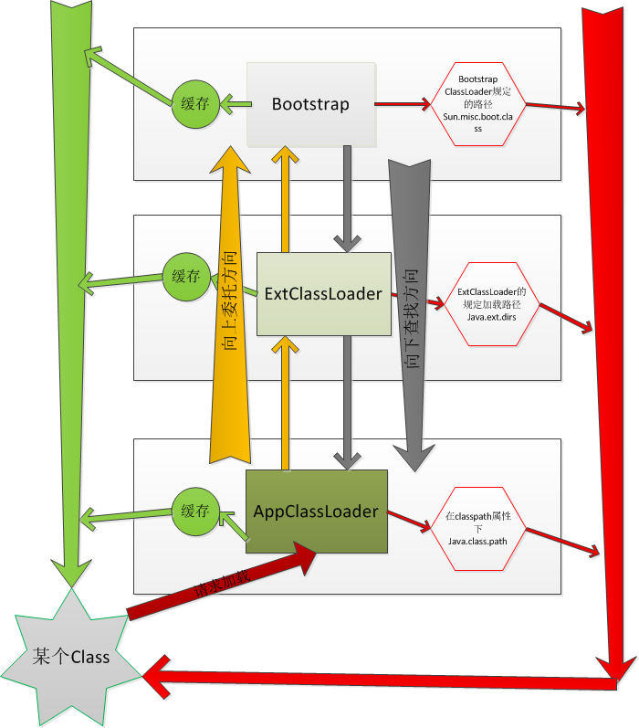

JDK
===
面试重点

https://github.com/doocs/jvm

1. [Java8内存模型—永久代(PermGen)和元空间(Metaspace)](https://www.cnblogs.com/paddix/p/5309550.html)
1. [只要重写了equals方法，就必须重写hashCode](https://www.jianshu.com/p/da2c0129c270)

## jdk的基础类

### java.util.Properties
这个类是一个继承自Hashtable

### java.util.Dictionary(abstract)
java里面与Python一样有字典结构

### java.util.Objects
null异常检测并且抛出
```java
        Objects.requireNonNull(inStream, "inStream parameter is null");
```
### java.net.URL
不仅经可以定位网络资源，也可以定位文件资源。


###  java.lang.ClassLoader	

双亲委派模型



目前最新的jdk将 ExtClassLoader改成了PlatformClassLoader。一般来说，类加载器可以找到类加载的位置，然后找到配置文件，读取配置文件。

```java
java.lang.ClassLoader.getResource(String name)
```

栗子：下面方式就可以读取resource文件夹下面的内容。

```java
         String fileName = "mq.json";
		ClassLoader classLoader = 当前类名.class.getClassLoader();
         URL url = classLoader.getResource(fileName);
         String path = url.getPath();
         File file = new File(path);
```

读取resource/文件夹里面的配置文件

```java

    ClassLoader classLoader =  Thread.currentThread().getContextClassLoader();
    System.out.println(classLoader);
	InputStream is = classLoader.getResourceAsStream("rexdb.xml");
```


#### systemClassLoader

```java
	ClassLoader.getSystemClassLoader()
```

#### 当前线程类加载器研究
```java
	Thread.currentThread().getContextClassLoader()
```
为了更好的理解，我们可以查看源码。
看sun.misc.Launcher,它是一个java虚拟机的入口应用。
```java
	public class Launcher { 
	private static Launcher launcher = new Launcher(); 
	private static String bootClassPath = System.getProperty("sun.boot.class.path"); 
	public static Launcher getLauncher() { 
	return launcher; 
	} 
	private ClassLoader loader; 
	public Launcher() { 
	// Create the extension class loader ClassLoader extcl; 
	try { extcl = ExtClassLoader.getExtClassLoader(); } 
	catch (IOException e) { 
	throw new InternalError( "Could not create extension class loader", e); } 
	// Now create the class loader to use to launch the application 
	try { loader = AppClassLoader.getAppClassLoader(extcl); } 
	catch (IOException e) { 
	throw new InternalError( "Could not create application class loader", e); } 
	//设置AppClassLoader为线程上下文类加载器，这个文章后面部分讲解 
	Thread.currentThread().setContextClassLoader(loader); }

```

————————————————
版权声明：本文为CSDN博主「frank909」的原创文章，遵循 CC 4.0 BY-SA 版权协议，转载请附上原文出处链接及本声明。
原文链接：https://blog.csdn.net/briblue/article/details/54973413

#### 当前类的加载器
```java
 	getClass().getClassLoader()
```

### jvm参数

'-Djava.security.egd=file:/dev/./urandom'   －  SecureRandom在java各种组件中使用广泛，可以加快随机数产生过程；建议添加

'-Dspring.profiles.active=prod'   －执行springboot项目使用配置 application-prod.yml；可选

'-Dfile.encoding=utf-8'  - 如果有下载文件代码，不加此句容易出现中文乱码；可选

'-Duser.timezone=GMT+08'  - Java获取时间与系统时间相差8小时的解决方法；可选
————————————————
版权声明：本文为CSDN博主「星梦天河」的原创文章，遵循CC 4.0 BY-SA版权协议，转载请附上原文出处链接及本声明。
原文链接：https://blog.csdn.net/mxskymx/java/article/details/99713480


### 缓存行对齐

高并发技巧

这个就解释了为啥需要知道基础类型的对应字节是多少，常见的就好了。因为需要缓存行对齐啊。

https://blog.csdn.net/mofeizhi/article/details/106816026
https://blog.csdn.net/weixin_45702700/article/details/114188435
