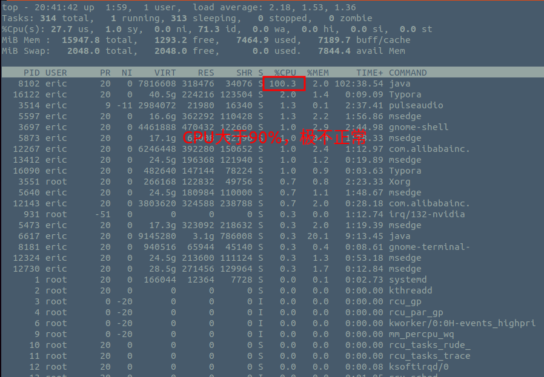
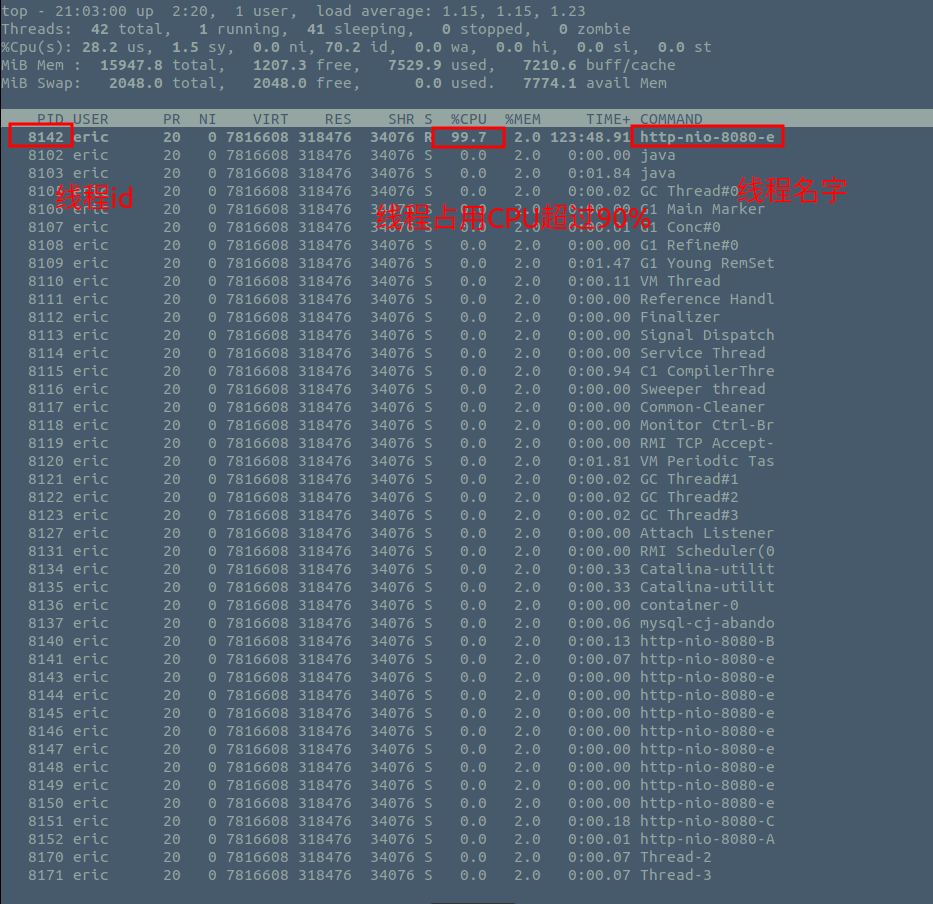
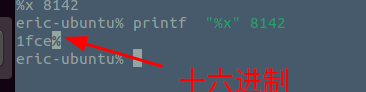
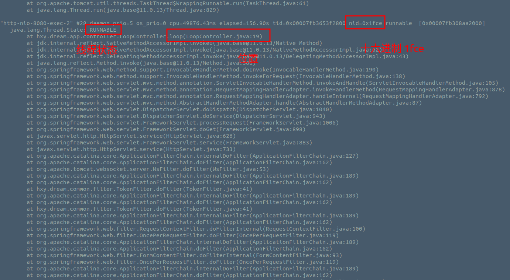
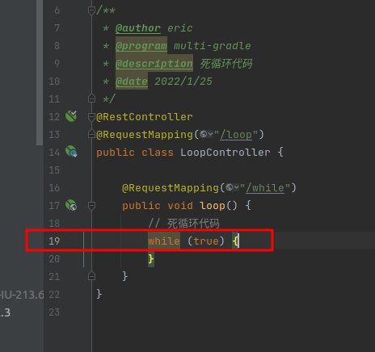

代码死循环分析
===

这种一般出现在使用while的代码块里面。
多半是while始终无法结束，类似 while(true)了。

## 代码样例

https://gitee.com/eric-tutorial/SpringCloud-multiple-gradle/blob/master/app/src/main/java/hxy/dream/app/controller/DeadLockController.java

```java
package hxy.dream.app.controller;

import org.springframework.web.bind.annotation.RequestMapping;
import org.springframework.web.bind.annotation.RestController;

/**
 * @author eric
 * @program multi-gradle
 * @description 死循环代码
 * @date 2022/1/25
 */
@RestController
@RequestMapping("/loop")
public class LoopController {

    @RequestMapping("/while")
    public void loop() {
        // 死循环代码
        while (true) {
        }
    }
}


```

## 问题定位

程序代码死锁的表现，CPU>100%。一般认为正常系统认为CPU不要超过90%。

第一步找到进程



```java
top -H -p pid
```

```java
top -H -p  8102
```



上面可以看出来线程的id是 `8142` 转成十六进制就是 `1fce`

```shell
 printf  "%x" 8142
```



然后再用命令`jstack 8102`(进程id，不是线程id)，打印出进程里面的所有线程状态信息。然后再找到 nid=0x1fce的线程，就定位出来是哪个线程发生了死循环导致CPU暴涨。



代码行数：19


