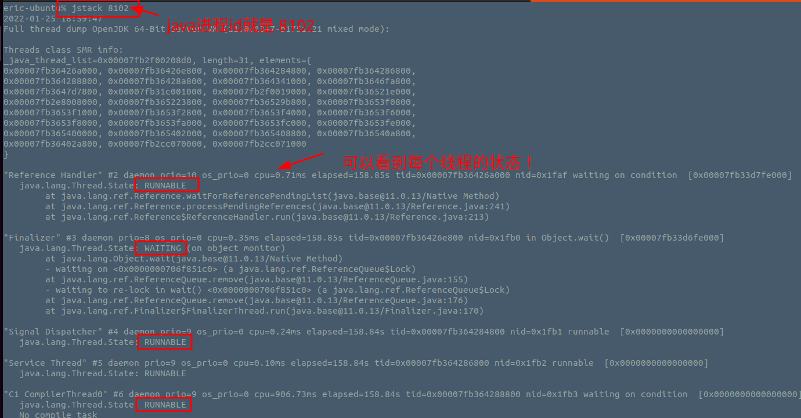
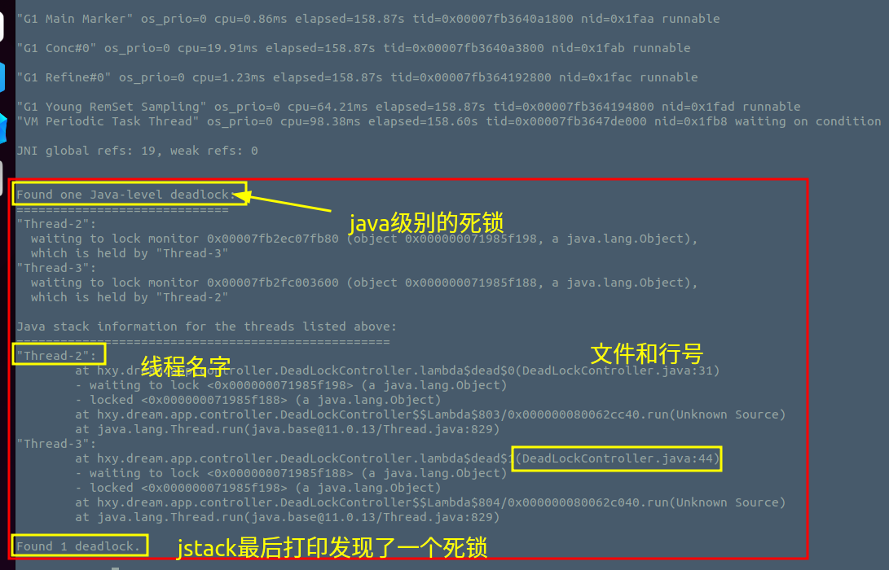
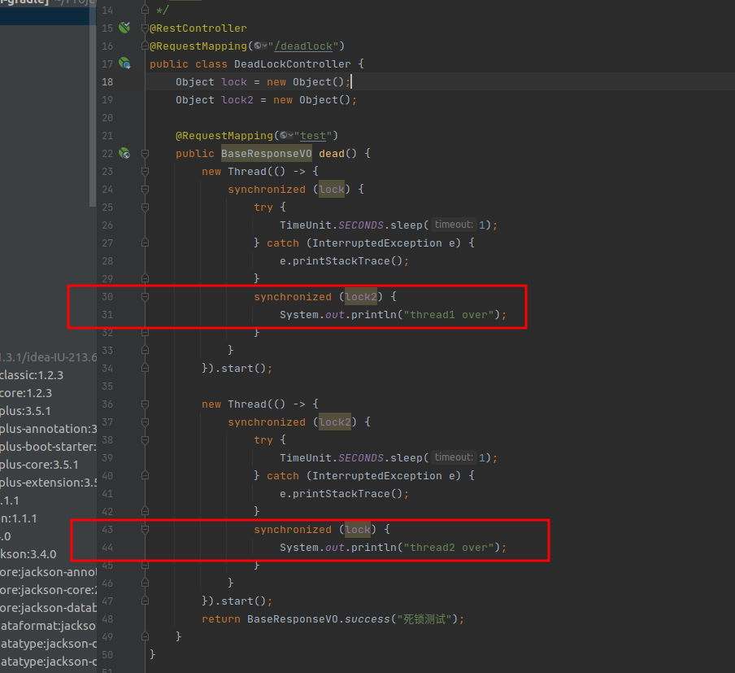

程序死锁分析
============

这种情况在运用多线程编程的时候比较容易出现。


## 死锁产生的四个条件
- 互斥条件
临界资源是独占资源，进程应互斥且排他的使用这些资源。
- 占有和等待条件
进程在请求资源得不到满足而等待时，不释放已占有资源。
- 不剥夺条件
又称不可抢占，已获资源只能由进程自愿释放，不允许被其他进程剥夺。
- 循环等待条件

又称环路条件，存在循环等待链，其中，每个进程都在等待链中等待下一个进程所持有的资源，造成这组进程处于永远等待状态。
死锁只有在这四个条件同时满足时出现。

## 死锁产生的原因
死锁产生的原因有很多，如：

进程顺序不当
PV操作使用不妥
同类资源分配不均
对某些资源的使用未加限制
等等。

> 可见，产生死锁的原因不仅与系统拥有的资源数量有关，而且与资源分配策略、进程对资源的使用要求以及进程的推进顺序有关。

## 样例代码

```java
package hxy.dream.app.controller;

import hxy.dream.entity.vo.BaseResponseVO;
import org.springframework.web.bind.annotation.RequestMapping;
import org.springframework.web.bind.annotation.RestController;

import java.util.concurrent.TimeUnit;

/**
 * @author eric
 * @program multi-gradle
 * @description 死锁代码
 * @date 2022/1/25
 */
@RestController
@RequestMapping("/deadlock")
public class DeadLockController {
    Object lock = new Object();
    Object lock2 = new Object();

    @RequestMapping("test")
    public BaseResponseVO dead() {
        new Thread(() -> {
            synchronized (lock) {
                try {
                    TimeUnit.SECONDS.sleep(1);
                } catch (InterruptedException e) {
                    e.printStackTrace();
                }
                synchronized (lock2) {
                    System.out.println("thread1 over");
                }
            }
        }).start();

        new Thread(() -> {
            synchronized (lock2) {
                try {
                    TimeUnit.SECONDS.sleep(1);
                } catch (InterruptedException e) {
                    e.printStackTrace();
                }
                synchronized (lock) {
                    System.out.println("thread2 over");
                }
            }
        }).start();
        return BaseResponseVO.success("死锁测试");
    }
}

```

## 问题定位

死锁的时候，代码的CPU一般不会很高。
死锁的代码很好找出来，先找到Java的线程。

`top`或者`ps -ef |grep java`

然后直接使用jstack pid打印出当前进程内线程的运行状态信息。



最下面就会提示死锁的情况！




代码位置


