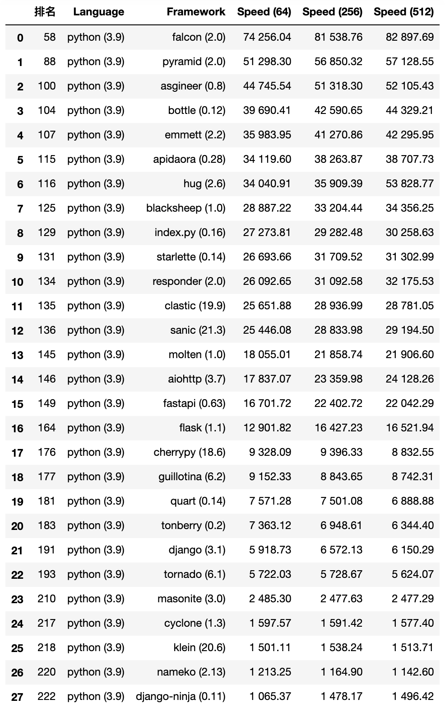

Python
===
## IDE

### Pycharm

https://www.jetbrains.com/pycharm/

### Thonny

https://thonny.org/

### vscode

https://code.visualstudio.com/

### Jupter

https://jupyter.org/

### pyzo

https://pyzo.org/index.html

## Python基础语法

[线程池](https://mp.weixin.qq.com/s/C6k8hkVzYo4LXgqKFKjvVw)


## Python基础操作


[Python将自己代码封装成库（whl）](https://blog.csdn.net/congcong_i/article/details/118908474)


## 常用框架

### 网络请求

#### requests

https://docs.python-requests.org/zh_CN/latest/

```

'''
Created on 2018年7月26日

@author: aohanhongzhi
'''
#!/usr/bin/env python
#coding=utf-8
import requests
r = requests.get("http://www.baidu.com/")
r.encoding = "utf-8"
print(r.text)


```

#### httpx 

https://www.python-httpx.org/

#### aiohttp

https://docs.aiohttp.org/en/stable/

### web框架

#### 异步和同步

异步解决的是多个相同任务的并发性，而不是单个任务的处理时间。异步的模型里，单个任务的处理时间没有减少。只是将原来多个任务由串行变成了并行形式的处理。所以说减少了整体任务的处理时间。可以理解就是Java里面的Callable线程的处理，可以让多任务几乎同时开始处理，然后再返回结果Future一一处理。

 [一篇文章，搞懂异步和多线程的区别](https://zhuanlan.zhihu.com/p/350816301)：异步和多线程并不是一个同等关系，异步是最终目的，多线程只是实现异步的一种手段。


使用异步模型，意味着所有地方都得使用异步代码。

例如，如果微服务使用的一个请求库，但不是异步的，那么每个查询HTTP端点的请求都会阻塞事件循环，此时并不能从异步中获益。

将一个现有项目改为异步模式并不容易，因为这需要彻底修改他的设计。大多数想支持异步调用的项目都是从头设计一切的。


下面列出一些与构建微服务相关的库：

1. aiohttp.Client:可用来替换requests包。
2. aiopg:构建在Psycopg上的PostgreSQL驱动
3. aiobotocore:AWS客户端
4. aioredis:Redis客户端
5. aiomysql：Mysql客户端，基于Pymysql构建。

若找不到某些库的替代品，asyncio提供一个执行器(executor)，可用来在独立线程或进程中执行阻塞代码。这个函数是一个协同程序，底层使用concurrent模块中的ThreadPoolExecutor或者ProcessPoolExecutor类。

下面通过线程池来使用requests库：

```python
import asyncio
from concurrent.futures import ThreadPoolExecutor

import requests

"""
阻塞和非阻塞是一种过程
异步和同步是一种代码模式，模型，或者形式。
"""


# 阻塞的代码

def fetch(url: str):
    return requests.get(url).json


URLS = ['http://easyprint.vip:8080/system/info', "http://open.iciba.com/dsapi/?date=2021-05-03"]


# 非阻塞的代码 coroutine
async def example(loop):
    executor = ThreadPoolExecutor(max_workers=3)
    tasks = []
    for url in URLS:
        # 这里就是相当于java的callable线程的新建
        tasks.append(loop.run_in_executor(executor, fetch, url))
    completed, pending = await  asyncio.wait(tasks)
    for task in completed:
        print(task.result())


if __name__ == '__main__':
    loop = asyncio.get_event_loop()
    loop.run_until_complete(example(loop))
    loop.close()

```


下面这个框架可以用Apache服务器托管任意的Python框架

https://modwsgi.readthedocs.io/en/develop/


#### Django

*Django makes it easier to build better web apps more quickly and with less code.*

https://www.djangoproject.com/


https://github.com/django/django

61.8k star


#### flask

中文文档：

<http://docs.jinkan.org/docs/flask/>

英文文档：

<https://flask.palletsprojects.com/>

1. python的flask使用gunicorn部署，docker应用部署python flask

2. flask 的MVC模型构建

3. yaml配置文件设置

   

https://github.com/pallets/flask

57.7k star


学习视频

https://www.bilibili.com/video/BV18441117Hd

##### gunicorn flask生产部署

https://gunicorn.org/


#### fastapi

官网 https://fastapi.tiangolo.com/zh


https://github.com/tiangolo/fastapi

40.6k star

非常优秀的框架，采用携程性能可以与Go比肩。实际使用的时候，发现集成peewee的时候发现这个与controller接口的时候有问题，不能使用同一个类对象来处理参数反序列化和数据库存储。所以很麻烦。 **可以尝试使用**

有基于对象的反序列化参数接收，和序列化的json返回给前端。不建议折腾，在序列化方面处理不是很好，用起来很麻烦。


##### uvicorn fastapi生产部署

The lightning-fast ASGI server.

fastapi使用这个作为web 容器部署的。

https://www.uvicorn.org/

#### starlette

fastapi貌似基于这个开发。

https://www.starlette.io/

#### falcon

应该是Python中测试最快的框架了。

The no-nonsense REST API and microservices framework for Python developers, with a focus on reliability, correctness, and performance at scale.

https://falconframework.org/

https://github.com/falconry/falcon 8.7k


#### aiohttp

Asynchronous HTTP Client/Server for asyncio and Python.

https://docs.aiohttp.org/en/stable/

https://github.com/aio-libs/aiohttp

12.1k


#### vibora

这个框架的活跃度非常低，代码更新还是2019年的。

https://github.com/vibora-io/vibora


下面这个框架测试方案值得参考下

https://github.com/vibora-io/benchmarks

##### Performance (Infamous Hello World benchmark)

| Frameworks | Requests/Sec | Version |
| ---------- | ------------ | ------- |
| Tornado    | 14,197       | 5.0.2   |
| Django     | 22,823       | 2.0.6   |
| Flask      | 37,487       | 1.0.2   |
| Aiohttp    | 61,252       | 3.3.2   |
| Sanic      | 119,764      | 0.7.0   |
| Vibora     | 368,456      | 0.0.6   |

#### sanic

哈罗单车就是选用这个框架的，这个框架的速度非常优秀。生态也是非常的完善，很适合做企业级的生产开发。

https://sanic.dev/en/

https://sanic.readthedocs.io/en/latest/

https://sanic.readthedocs.io/en/stable/

https://sanicframework.org/zh/guide/

https://github.com/sanic-org/sanic/ 15.8k


论坛

https://community.sanicframework.org/


sanic的生态扩展

https://github.com/mekicha/awesome-sanic


[Python 里最好用的Web框架居然不是Django和Flask，居然是它？？？](https://juejin.cn/post/6944598601674784775)


https://www.jianshu.com/p/636833c71c2a


基于sanic搭建微服务体系。
主要采用sanic + 服务注册 consul + fabio
https://www.jianshu.com/p/c3e34228f4fa

参考demo

https://gitee.com/eric-tutorial/sanic_demo


####  moltenframework

> https://moltenframework.com/


#### Tornado

[Tornado](https://www.tornadoweb.org/) is a Python web framework and asynchronous networking library.

non-blocking network I/O


https://www.tornadoweb.org/en/stable/

https://github.com/tornadoweb/tornado

20.4k star


#### PyWebIO

交互式web应用，很适合少儿编程的入门

https://github.com/wang0618/PyWebIO

https://pywebio.readthedocs.io/zh_CN/latest/


#### 其他框架可以看这个

https://juejin.cn/post/6944598601674784775




## ORM 数据库操作框架

#### aestate

https://gitee.com/aecode/aestate

#### Peewee

https://github.com/coleifer/peewee

http://docs.peewee-orm.com/en/latest/

一个Python的轻量级ORM框架，确实很简易

#### orator

一个Python的轻量级ORM框架，确实很简易

https://github.com/sdispater/orator


## 日志

### loguru
使用非常不错，日志级别，颜色，行号
> https://loguru.readthedocs.io/en/stable/index.html

参考：

https://blog.csdn.net/adz41455/article/details/101648648


### 日志集中管理的一些方案

#### Graylog

开源，但是也是一个商业的工具。与ELK类似。

https://graylog.org


#### sentry

这个对于个人开发者免费，但是企业不是免费的

https://sentry.io/welcome/


## 进程管理方案

### supervisor

http://supervisord.org/

### Circus

Circus是与supervisor类似的进程监控工具，它也是使用Python编写的。

https://github.com/circus-tent/circus

官方文档 https://circus.readthedocs.io/en/latest/


https://cloud.tencent.com/developer/article/1195734


#####  34个最优秀好用的Python开源框架

https://zhuanlan.zhihu.com/p/58557451

https://pyre-check.org/


## Python


1. [将CSV文件导入数据库](https://gitee.com/cctv-eric/peewee-python)
1. [安装指导](http://docs.peewee-orm.com/en/latest/peewee/installation.html)
1. [快速开始](https://www.jianshu.com/p/16d1c330810c)
1. [peewee用法考察](https://www.jianshu.com/p/182ea382b99f)
1. [指定数据库表的名字](https://www.osgeo.cn/peewee/peewee/models.html#creating-model-tables)

    ```python
    class UserProfile(Model):
    class Meta:
        table_name = 'user_profile_tbl'
    ```

### awesome-python

1. https://github.com/vinta/awesome-python
1. http://jobbole.github.io/awesome-python-cn/

### 优秀的库

#### 哪些 Python 库让你相见恨晚？

知乎：https://www.zhihu.com/question/24590883

#### pandas-profiling

一行代码分析数据

#### Playhouse

这个库可以很方便的将对象转成dict（json），[它里面的model_to_dict和dict_to_model两个方法](https://www.cnblogs.com/fnng/p/6879779.html)。

* [官方文档](http://docs.peewee-orm.com/en/latest/)
* [中文文档](https://www.osgeo.cn/peewee/index.html)


#### fakker

数据造假

https://faker.readthedocs.io/en/master/
