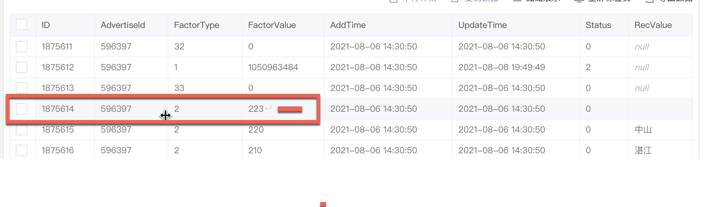

为往圣继绝学
====

# 编程思想
1. 防御式编程，依据墨菲定律，一个事情可能会发生，那么后期必然会发生。
2. 不规范代码一时爽，重构直接火葬场！

# 开发规范

## 基础常识

1. 代码里最好全部是英文，不建议写中文的字符，因为可能会造成乱码的现象。
1. 建议最好使用int等基础类型，如果使用Integer会造成拆箱装箱的消耗。
2. 字段等需要有明确意义的doc文档，或者swagger文档，不会影响程序性能。
3. 一定要严格检查NPE，任何可能为NULL的都需要检查。如果发生可能NPE导致无法继续执行，那么可以直接返回即可！
4. 边界值判断。


## 编码基本操作

### 注意空格，回车等看不见的数据



上面这张图展示了数字多了一个回车，导致格式化错误。这种案例可能比较少见，但是最好有比较好的处理措施。

> trim()只能去掉半角空格，全角空格也是不可以的。


### 线上部署之前

1. 需要经过IDEA build然后，在本地运行一下，确认可以之后再次跑起来就好了。

## 流
1. 各种文件流需要及时关闭


## ORM层操作

1. 数据库操作的方法,返回的是 **影响行数** ,一定要判断是否操作成功并记录(异常记录下).获取id直接通过对象即可(mybatis-plus)

2. 按需查询。查询只需要查询所需的列，多余的会造成数据库的大量IO，严重影响效率。

3. DO或者Model应该与数据库的列严格对应。Java对象驼峰式命名，数据库的列按照大写字母前加下划线并且转成小写的形式。建议可以参考[国产rexdb的ORM框架](https://gitee.com/rexsoft/rexdb)，只能按照上述方式定义，不接受其他方式。

   ```java
   userName ->  user_name
   ```

   

4. 查询数据一定要注意数据量，禁止selectAll。
5. 基本上查询的数据都需要考虑是否走了索引


## 异常
2. 对于异常,如果处理了(记录下来)就不要抛出,没有处理就抛出.由最后一个使用者处理即可.
3. 异常需要记录 **入参** ,不要打印没有意义的操作,如果是没有多大意义的建议debug记录,线上部署就只记录info级别.千万不要直接使用System.out.print这种记录日志!

## 工具类
1. 工具类建议采用静态类的调用方式，就不需要使用new关键字这种显示创建实例并且调用方法。因为本质上工具类多半使用其方法，所以直接使用静态类的方法，直接调用即可，无需新建对象。
2. 

## DAO层

1. 如果是多个表联合查询，一般不要超过三个可以写sql查询。如果是超过了三个建议使用Mapper一个个的查询。尤其是sql语句写的长的时候，依据笛卡尔积得到的结果产生的量就比较大。
2. 是

## Service层

1. 一定要基于接口编程，例如文件操作，可以写FileService。后面有可能会使用MongoDBServiceImpl来实现这个FileService接口，有可能使用FastDFSService实现这个FileService接口。就是一个接口可能会有多个实现的方式。而且可能初期使用MongoDBServiceImpl后期可能会切换到FastDFS，所以面向接口编程，可以很好地切换实现的方式，不然改代码都是哪里使用到了就需要修改哪里。


## Controller层

1. 这一层主要负责与前端交互，作为一个优秀的web框架，应该考虑用对象接收参数（json反序列化成对象）并且用对象返回结果（对象序列化成json）。也就是序列化在这里是一个优秀web框架的基本特征，否则使用起来非常麻烦。

# 学习资料

1. [rexdb-国产ORM框架](https://gitee.com/rexsoft/rexdb)