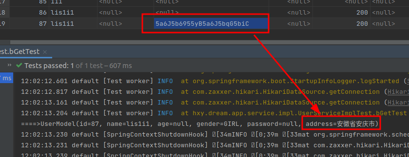

MybatisPlus数据库加解密
=======================

应用场景：账户余额加密，开发人员交付系统后也不会查询到用户密码。DBA也无法知道账户余额。这样基本上只有使用系统的人才知道账户余额是多少。

有些OA系统里，可能DBA是可以直接查询到各种人工资的余额的。


# KeyCenterUtils：加解密工具类

```java

import java.util.Base64;

public class KeyCenterUtils {

    /**
     * 自己写加密逻辑
     */
    public static String encrypt(String src) {
        try {
            String result = Base64.getEncoder().encodeToString(src.getBytes("UTF-8"));
            return result;
        } catch (Exception e) {
            throw new RuntimeException("encrypt fail!", e);
        }
    }

    /**
     * 自己写解密逻辑
     */
    public static String decrypt(String src) {
        try {
            byte[] asBytes = Base64.getDecoder().decode(src);
            String result = new String(asBytes, "UTF-8");
            return result;
        } catch (Exception e) {
            throw new RuntimeException("decrypt fail!", e);
        }
    }

}

```

# BaseTypeHandler处理

```java
package hxy.dream.dao.configuration.mybatis;

/**
 * @ClassName AESTypeHandler
 * @date 2020/4/9  14:27.
 * @Description
 */

import com.baomidou.mybatisplus.core.toolkit.StringUtils;

import hxy.dream.dao.util.KeyCenterUtils;
import org.apache.ibatis.type.BaseTypeHandler;
import org.apache.ibatis.type.JdbcType;
import org.springframework.stereotype.Service;

import java.sql.CallableStatement;
import java.sql.PreparedStatement;
import java.sql.ResultSet;
import java.sql.SQLException;

/**
 * 数据库字段加解密处理
 *
 * @param <T>
 */
@Service
public class CustomTypeHandler<T> extends BaseTypeHandler<T> {


    public CustomTypeHandler() {
    }

    @Override
    public void setNonNullParameter(PreparedStatement ps, int i, Object parameter, JdbcType jdbcType) throws SQLException {
        ps.setString(i, KeyCenterUtils.encrypt((String) parameter));
    }

    @Override
    public T getNullableResult(ResultSet rs, String columnName) throws SQLException {
        String columnValue = rs.getString(columnName);
        //有一些可能是空字符
        return StringUtils.isBlank(columnValue) ? (T) columnValue : (T) KeyCenterUtils.decrypt(columnValue);
    }

    @Override
    public T getNullableResult(ResultSet rs, int columnIndex) throws SQLException {
        String columnValue = rs.getString(columnIndex);
        return StringUtils.isBlank(columnValue) ? (T) columnValue : (T) KeyCenterUtils.decrypt(columnValue);
    }

    @Override
    public T getNullableResult(CallableStatement cs, int columnIndex) throws SQLException {
        String columnValue = cs.getString(columnIndex);
        return StringUtils.isBlank(columnValue) ? (T) columnValue : (T) KeyCenterUtils.decrypt(columnValue);
    }
}


```

# 实体类上使用

实体类上继续加上`autoResultMap = true`

实体属性上 `@TableField(typeHandler = CustomTypeHandler.class)`

```java
@Data
@TableName(value = "user_model", autoResultMap = true)  //有了这个BaseMapper查询的结果才能解密
@EqualsAndHashCode(callSuper = false)
public class UserModel extends BaseModel<UserModel> {
    /**
     * 参考yaml文件配置id-type: auto
     */
    @TableId(type = IdType.AUTO)
    Integer id;
    String name;
    Integer age;
    GenderEnum gender;
    String password;

    //有了这个数据库BaseMapper插入的时候才能加密
    @TableField(typeHandler = CustomTypeHandler.class)
    String address;
}

```

# 效果



> 参考 https://blog.csdn.net/u012954706/article/details/105437768
