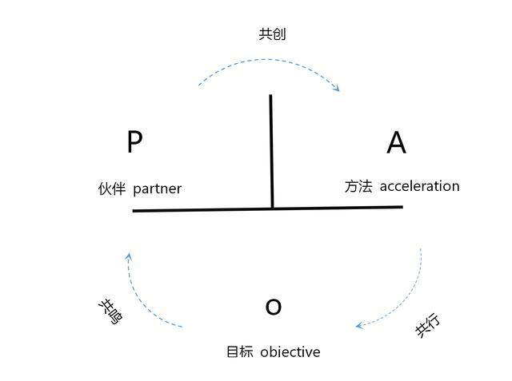
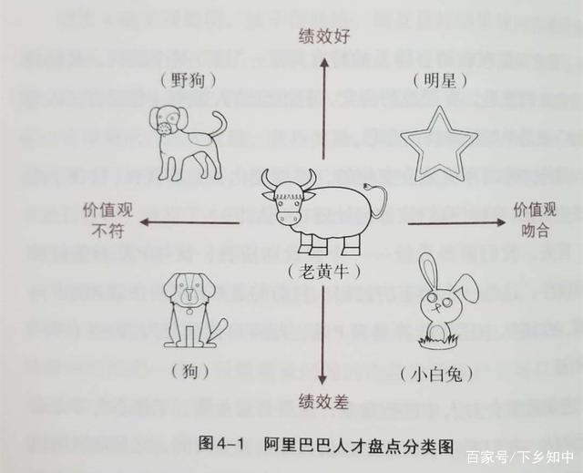

《这就是POA》，为什么是可以复制的极简管理学
===========================================

这几年POA的理论挺火的。作为新兴的理论。最容易被很多玄学者拿来割韭菜。就像17年的区块论一样。

这些玄学者有2个特点，首先就是把什么事情都往POA上面扯，然后就尽量把事情说的复杂。让你云里雾里，不明觉厉，然后掏腰包参加培训班或者交咨询费。等问到效果的时候，就变成心诚则灵了。时间长了点，不免对POA这个理论，就产生厌烦的感觉了。

好在最近出了一本《这就是POA》的书，里面用看上去很简单，甚至很常见里的例子来解释POA。显得非常没有“技术含量”。但是要知道，把简单是事情说复杂很容易，但是把复杂的事情说简单。却很艰难。只有深入，才能浅出。

试着举一下书中的例子和内容，让你了解下，为什么这本书叫做可以复制的极简管理学。

一、区分目标和手段，是进行管理的第一步

“我要赚钱", 这4个字是目标，还是手段呢？这个问题咋一看，好像挺简单的，赚钱当然是目的了。但是如果更加深入地问一下，赚钱是为了干什么？可能就会有很多的回答。比如说改善现在贫穷的生活条件，为了去世界看一看，或者成为世界的首富。

赚钱的目标不同，那么赚钱的手段也会不一样。如果只是想改变贫穷的生活，那么摆地摊也可以达成目的。但是如果想成为世界首富，靠摆地摊来作为起点，可能成功性就太低，不是第一选择。而想去世界看一看，与其摆地摊，不如写游记。哪怕跨境带货也比摆地摊更靠谱。

所以看看，”我要赚钱“，并不是一个目的，而是实现目的的一个手段。那么为什么我们经常会把手段当作目的的，原因就在于，我们在制定目标的时候，少问一个为什么要达到这个目标WHY。这是一种无意识的偷懒，在个人和组织身上，都常常会看到这种情况。

在POA的理论里，O=OBJECETIVE，是目标；P=PARTNER，是伙伴；A=ACCELERATION，是方法。它们三者的关系是：目标O能凝聚伙伴P，伙伴P可以共创方法A，方法A可以服务目标O。

如下图

由此可见，伙伴和方法，都是为了目标服务的，所以一旦目标不准确，那么伙伴和方法就成了无源之水，无本之木。就比方在企业里，讲究KPI，本来是为了做出业务服务的，但是常常就变成了为了KPI服务，一切围绕着KPI。当KPI达不到的时候，就增加监督人手，加大惩罚力度。而我们忘记了我们设立KPI的原本目的是什么。从而让企业进入了空转。看上去每个人都在努力地忙碌，但是公司的业务却不见起色甚至更差。

二、不讲清任务目标和执行手段的领导，是差劲的领导

在《这就是POA》一书里，举了日本人发布任务说5次的案例。为什么举这个案例的，就是为了说明。领导下达任务，其目的是为了让员工完成这个任务。而不是借此来考验员工的能力。因此，先说一下任务，再让员工复述一次，然后询问员工对这个任务的看法，再询问员工完成任务的方法，最后确定领导和员工在这个任务中的权责。

在日常管理工作中，最大的，也是最常见的损失，就是效果不好，任务重做。既浪费了时间成本，也浪费了人力成本 ，并且使公司的士气大降而员工的怨气激增。但是表现上，公司好像还看上去事务繁忙，人气沸腾。

所以安排工作如此5遍，就是为了完成O的那个A。这是一个好领导的表现。那么反过来看，如果是一个基层的员工也了解了POA，遇到领导交代任务的时候含糊不清，方法不明，标准不定的情况。那么就会有2个明确的判断：1、领导不想让这个任务完成。2、这不是一个称职的好领导。无论哪一样，这样的领导都不值得追随。

同理，了解了POA理论中，方法是为了目标服务的，那么在公司的管理制度中，领导安排工作是否明确，交代任务是否清晰，就会是考核的一个重点。而不是仅仅把完成任务的压力，全部放在员工的身上。我们考核的目标，是为了顺利地完成任务，而不是惩罚领导和员工。

三、伙伴

书中举了一个同机一起飞向意大利的闺蜜，是否就是同行者的这个P。答案是，如果他们去意大利要干的事情相同，才是伙伴，如果要干的事情不同。就不是伙伴。看上去特别容易理解并且不深奥。

但是放在公司的管理和运营中，就经常会发现想创业的老板和只想吃一碗安定的饭养家糊口的员工在同一个办公室。而这个老板一心想把员工变成创业的P，却往往不成功。原因就在于把同机的人，误当作了真实的创业伙伴。

这个时候怎么办呢，要么改变员工对目标和公司目标一致。要么换同行人的。而改变员工的目标，不能仅仅只靠画大饼，并且员工也分三六九等。这里又举了阿里的员工象限分法。要把野狗和老黄牛训练成明星员工，小白兔至少训练成老黄牛而把狗给抛弃掉。

你看看，从上面三个例子来看，都是把普通的管理案例做了一个挖掘和引申，就让人们在POA管理上面，感觉浅显易懂，焕然一新。让新手直接做结论党照搬标准，让管理者读完豁然开朗并举一反三，。这就是这本书宣称是可以复制的极简管理学的原因。

当然里面那些如果对计划进行分解，如何让组织飞轮动起来，如何避免潜移默化却天天存在的组织负债。就请大家去亲自看看这本书了。
