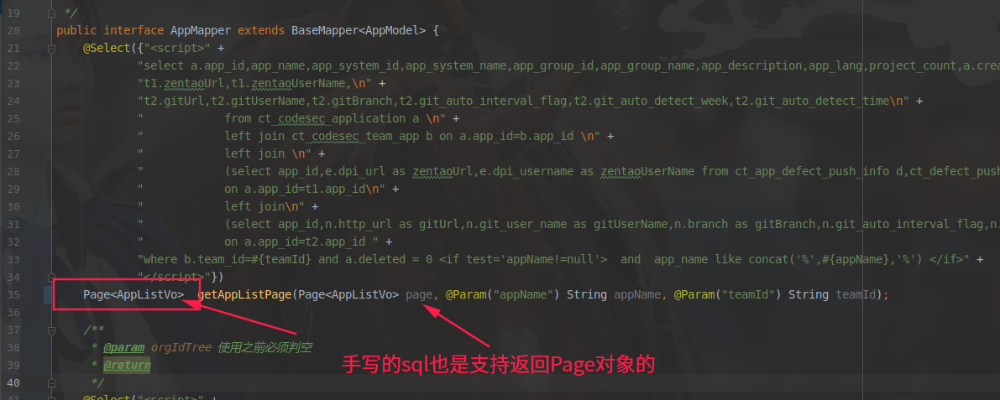

mybatis-plus学习
===
## 官网
[https://mybatis.plus/](https://mybatis.plus/)

### 码云
[https://gitee.com/baomidou/mybatis-plus](https://gitee.com/baomidou/mybatis-plus)

### 我写的公众号文章

https://mp.weixin.qq.com/s/ci4taJx0nOu3rLp8dwHUng

## 基本配置,导入依赖
### SpringBoot下:
```groovy
compile 'com.baomidou:mybatis-plus-boot-starter:3.3.0'
runtimeOnly 'mysql:mysql-connector-java:8.0.16'
```

### yaml配置
```
mybatis-plus:
  mapper-locations: classpath:mapper/*.xml
  configuration:
    #    配置日志
    log-impl: org.apache.ibatis.logging.stdout.StdOutImpl
  type-aliases-package: hxy.cupb.springboot.model
  # 支持统配符 * 或者 ; 分割
  typeEnumsPackage: com.baomidou.springboot.entity.enums
  global-config:
    db-config:
      logic-delete-field: flag  #全局逻辑删除字段值 3.3.0开始支持，详情看下面。
      logic-delete-value: 1 # 逻辑已删除值(默认为 1)
      logic-not-delete-value: 0 # 逻辑未删除值(默认为 0)
```

## 配置Mapper,Model,Service,注解,XML
### 所有Model应该继承mybatis-plus的Mode
作用就是将Java的对象Model与数据库的表对应起来.也就是对象关系映射,这也是ORM框架的本质与作用.
[](https://imgchr.com/i/3QL9eA)

### 所有Mapper应该继承mybatis-plus的BaseMapper
继承mybatis-plus的BaseMapper的作用就是可以直接使用父接口的所有方法,而不需要再写很多的数据库查询操作方法.例如 selectById等.具体可以参考BaseMapper
[](https://imgchr.com/i/3QL76g)
BaseMapper的基本使用
[](https://imgchr.com/i/3QOBHs)

### 相关的Service应该继承mybatis-plus的IService
官网:[IService参考](https://mybatis.plus/guide/crud-interface.html#service-crud-%E6%8E%A5%E5%8F%A3)

虽然上面已经有了BaseMapper已经差不多够了,但是有些特殊的要求,例如不存在的就插入,存在的就更新这种.就需要用到IService了.IService有很多对BaseMapper扩展的逻辑.例如saveOrUpdate().具体可以参考IService.
[](https://imgchr.com/i/3QOT4x)
IService要比BaseMapper的方法多出两倍左右.

IService的基本使用
[](https://imgchr.com/i/3QXlxU)
[](https://imgchr.com/i/3QXrse)

单元测试

[](https://imgchr.com/i/3QXfRf)


### XML或注解配置方式
如果没有上述的BaseMapper和IService都没有直接解决需求,那还可以配置XML配置或者注解的方式.一般来说多个表查询,可以新建与之相关的数据库

## 总结
基本上mybatis-plus对大部分数据库操作的情况都考虑到了,如果要是有啥没有考虑到那就直接去修改源代码实现吧.相比较JPA而言,我特地测试了下update这个方法,之前JPA竟然会更新null值覆盖数据库存在的值,这个让我彻底放弃了JPA,回到了mybatis,并且使用mybatis-plus增强了下.既有JPA的简单,又有Mybatis的灵活性(可以写xml实现动态SQL语句等).

mybatis-plus的功能很丰富,可以参考官网.

逻辑删除(取消用户具有delete数据的权限),攻击SQL阻断器,多数据源,分布式事务等等.

## 使用

1. 分页加载

```java
    @Override
    public BaseResponseVO listErpManager(BasePageParam basePageParam) {
        Long pageSize = basePageParam.getPageSize();
        Long cuurent = basePageParam.getPageNum() * pageSize;
        IPage<ManagerModel> managerModelIPage = new Page(cuurent, pageSize);
        managerModelIPage = managerMapper.selectPage(managerModelIPage, null);
        return BaseResponseVO.success(managerModelIPage);
    }

```

手写sql也会支持分页的




