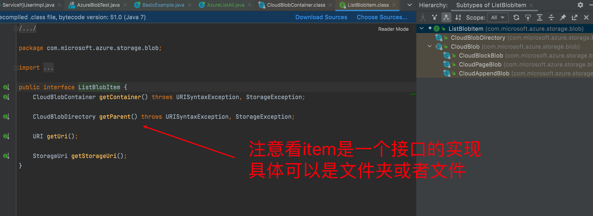

AzureBlob
===

## 查看某个文件夹下所有文件



```java

package azure;

import com.microsoft.azure.storage.CloudStorageAccount;
import com.microsoft.azure.storage.StorageException;
import com.microsoft.azure.storage.blob.CloudBlobClient;
import com.microsoft.azure.storage.blob.CloudBlobContainer;
import com.microsoft.azure.storage.blob.CloudBlobDirectory;
import com.microsoft.azure.storage.blob.ListBlobItem;

import java.net.URISyntaxException;
import java.security.InvalidKeyException;

/**
 * @author eric
 * @program admin2
 * @description
 * @date 2021/11/4
 */
public class AzureListAll {
    public static final String storageConnectionString = "DefaultEndpointsProtocol=https;AccountName=yingshi;AccountKey=cPvXkZrjoRggH2b1/4/BxTQxHLqhoXD1O7C1ncCk+luOhKqz/vS3pgCRVDdIMFVJwarBmI4moNGBbegCuw1UXA==;EndpointSuffix=core.chinacloudapi.cn";

    public static void main(String[] args) {
        CloudStorageAccount storageAccount;
        CloudBlobClient blobClient = null;

        try {
            storageAccount = CloudStorageAccount.parse(storageConnectionString);
            blobClient = storageAccount.createCloudBlobClient();
            CloudBlobContainer container1r = blobClient.getContainerReference("model");

            for (ListBlobItem blobItem : container1r.listBlobs()) {
                System.out.println("第一层文件夹 " + blobItem.getUri());
                if (blobItem instanceof CloudBlobDirectory) {
                    CloudBlobDirectory blobItem1 = (CloudBlobDirectory) blobItem;
                    Iterable<ListBlobItem> listBlobItems = blobItem1.listBlobs();
                    for (ListBlobItem listBlobItem : listBlobItems) {
                        System.out.println("第二层文件夹 " + listBlobItem.getUri());
                        if (listBlobItem instanceof CloudBlobDirectory) {
                            CloudBlobDirectory listBlobItem2 = (CloudBlobDirectory) listBlobItem;
                            Iterable<ListBlobItem> listBlobItems2 = listBlobItem2.listBlobs();
                            listBlobItems2.forEach(listBlobItems3 -> {
                                System.out.println("第三层文件夹里面的文件 " + listBlobItems3.getUri());
                            });
                        }
                    }
                }
            }
        } catch (URISyntaxException e) {
            e.printStackTrace();
        } catch (InvalidKeyException e) {
            e.printStackTrace();
        } catch (StorageException e) {
            e.printStackTrace();
        }
    }
}

```