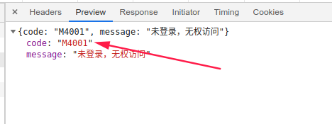
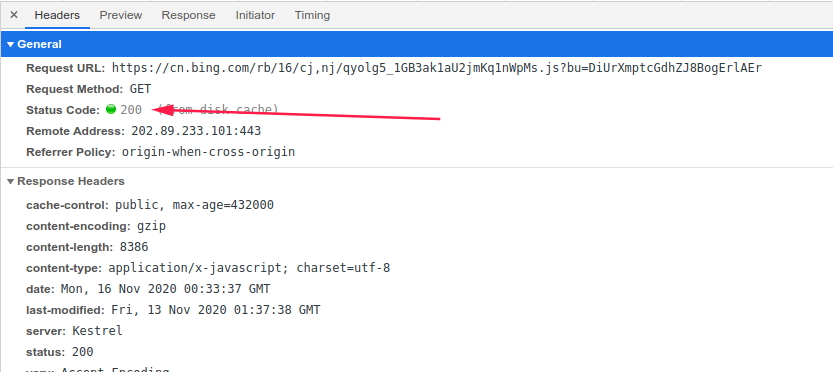
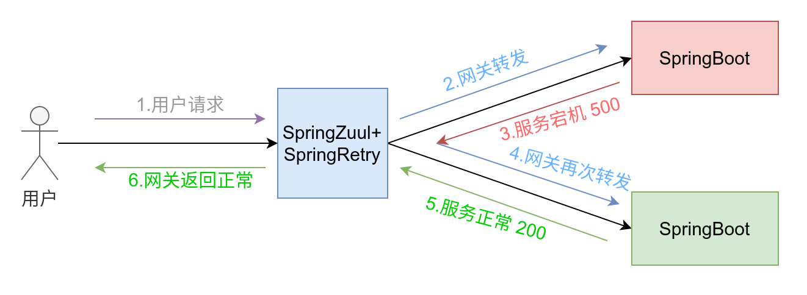
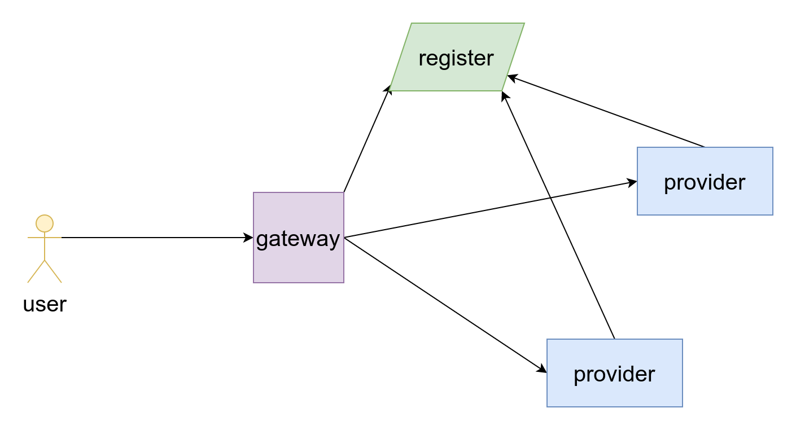
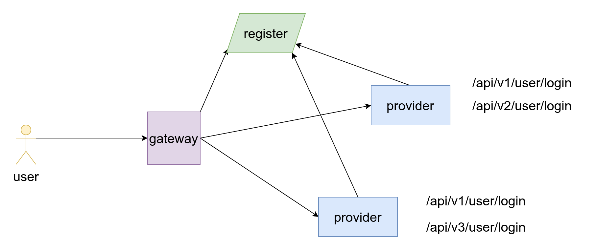

异常与事务以及故障转移和灰度发布
===


本文从微观到宏观展示异常,事务在系统的作用以及故障转移和灰度发布的简单实现。

## 当不满足条件的时候，应该直接返回，还是抛出异常？

例如为null的时候？登录密码校验不一致的时候？

这个问题一直困扰着我，因为异常的处理会消耗虚拟机的性能。但是在SpringSecurity等源码中发现，在密码校验失败的时候还是抛出异常来处理的。这就让人很疑惑，不知道出了意外的时候咋处理比较妥，是应该try住吞了，还是任由他去。

带着我多年的疑惑。下面就先从基本的知识点来一步一步从微观到宏观看看每一步怎么实现比较合理。

### 错误:

java.lang.Error 一般java虚拟机处理不了，程序不会从错误中恢复。这个一般服务返回的状态也是500，所以也是可以故障转移的。

### 异常:

**运行时异常**  RuntimeException

**检查性异常** 打开一个不存在的文件  IOException


#### 单个处理

异常处理的原则，要么就处理，要么就抛出。不要处理和抛出同时弄了，这里的处理是像logger.error()记录。很多情况下我们可能会觉得出现异常的时候也只能logger打个记录，并不能做什么其他的处理。这也是本文的重点，告诉你处理logger下，还可以进一步处理，实现故障转移。一般单个处理比较适合下面情况。

例如：

```java
    public final void afterPropertiesSet() throws IOException {
        if (this.singleton) {
            this.singletonInstance = this.createProperties();
        }
    }
```
> 单个处理适用于不得不处理的异常，例如方法后面标记了异常。

那么在调用这个方法的时候，要么就try住，要么就继续抛出。

第一种：再次抛出

```java
    @Bean
    public Properties quartzProperties() throws IOException {
    
        propertiesFactoryBean.afterPropertiesSet();

        return propertiesFactoryBean.getObject();
    }
```

第二种：直接处理了,logger记录下（无能为力），这应该是最常见的处理方式了。

```java
    @Bean
    public Properties quartzProperties() {
        PropertiesFactoryBean propertiesFactoryBean = new PropertiesFactoryBean();
        propertiesFactoryBean.setLocation(new ClassPathResource("/quartz.properties"));
        
        Properties object = null;
        try {
            propertiesFactoryBean.afterPropertiesSet();
            object = propertiesFactoryBean.getObject();
        } catch (IOException e) {
            log.error("\n====>{}", e.getMessage(), e);
        }
        return object;
    }
```


#### 批量处理

全局异常捕获

> 没有主动在方法后面标记抛出异常的情况。

例如，下面的insert并没有标记异常的抛出，但是当数据库发生意外的时候，还是会主动抛出异常。所以try了一下。

```java
try{
    userService.register(userModel);
}catch(RuntimeException e){
    logger.error("\n====>保存失败")
}
```

上面看出来处理确实比较稳妥，但是每个可能抛出异常的服务都这么弄，确实很容易造成所有的方法都需要try下。看起来不是优雅，所以建议使用全局异常捕获。此外这种编码还有一个不妥之处就是会影响事务的处理，事务失效的一个原因就是被吞了。

全局异常捕获目的就是为了捕获全局的异常，然后处理，最后返回给前端。看起来比直接返回给前端流程更长，处理更加麻烦。看完本文，细细体会，你应该能明白整个流程的合理性。

```java
import lombok.extern.slf4j.Slf4j;
import org.springframework.dao.DuplicateKeyException;
import org.springframework.http.HttpStatus;
import org.springframework.http.ResponseEntity;
import org.springframework.http.converter.HttpMessageNotReadableException;
import org.springframework.messaging.handler.annotation.support.MethodArgumentNotValidException;
import org.springframework.validation.BindException;
import org.springframework.web.HttpRequestMethodNotSupportedException;
import org.springframework.web.bind.MissingServletRequestParameterException;
import org.springframework.web.bind.annotation.ControllerAdvice;
import org.springframework.web.bind.annotation.ExceptionHandler;
import org.springframework.web.bind.annotation.ResponseBody;
import org.springframework.web.bind.annotation.ResponseStatus;

import javax.servlet.http.HttpServletRequest;
import javax.validation.ConstraintViolationException;
import javax.validation.ValidationException;

/**
 * Description:全局异常处理，采用@Controller + @ExceptionHandler解决
 * <br>自定义异常处理类
 *
 * @author eric
 */
@ControllerAdvice
@Slf4j
@ResponseBody
public class GlobalExceptionHandler {

    /**
     * 业务异常捕获
     *
     * @param request
     * @param e
     * @param <T>
     * @return
     */
    @ExceptionHandler(BaseException.class)
    public <T> BaseResponse<?> baseExcepitonHandler(HttpServletRequest request, BaseException e) {
        log.error("\n====>{} Exception", request.getRequestURI(), e.getMessage(), e);
        return BaseResponse.error(e.getMessage());
    }

    /**
     * ValidationException
     */
    @ExceptionHandler(ValidationException.class)
    public <T> BaseResponse<?> handleValidationException(ValidationException e) {
        log.warn(e.getMessage(), e);
        return BaseResponse.error("校验出错啦！", e.getMessage());
    }

    /**
     * 参数校验异常捕获 包括各种自定义的参数异常
     *
     * @param request
     * @param e
     * @param <T>fsFileId
     * @return
     */
    @ResponseStatus(HttpStatus.BAD_REQUEST)
    @ExceptionHandler(ConstraintViolationException.class)
    public <T> BaseResponse<?> constraintViolationExceptionHandler(HttpServletRequest request, ConstraintViolationException e) {
        log.warn("\n====>{} Exception Message: {}", request.getRequestURI(), e.getMessage(), e);
        return BaseResponse.error("参数错误", e.getMessage());
    }


    /**
     * 方法参数校验
     * https://blog.csdn.net/chengliqu4475/article/details/100834090
     */
    @ExceptionHandler(MethodArgumentNotValidException.class)
    public <T> BaseResponse<?> handleMethodArgumentNotValidException(MethodArgumentNotValidException e) {
        log.warn(e.getMessage(), e);
        return BaseResponse.error("参数检验出错啦！", e.getBindingResult().getFieldError().getDefaultMessage());
    }


    /**
     * 处理400参数错误
     *
     * @param e
     * @return
     */
    @ResponseStatus(HttpStatus.BAD_REQUEST)
    @ExceptionHandler(HttpMessageNotReadableException.class)
    public BaseResponse handleHttpMessageNotReadableException(HttpMessageNotReadableException e) {
        log.warn("参数解析失败{}", e.getMessage(), e);
        return BaseResponse.badrequest("参数解析失败", e.getMessage());
    }

    /**
     * 405错误方法不支持
     *
     * @param e
     * @return
     */
    @ResponseStatus(HttpStatus.METHOD_NOT_ALLOWED)
    @ExceptionHandler(HttpRequestMethodNotSupportedException.class)
    public BaseResponse handleHttpRequestMethodNotSupportedException(HttpServletRequest request, HttpRequestMethodNotSupportedException e) {
        log.warn("\n====>[{}]不支持当前[{}]请求方法,应该是[{},{}]", request.getRequestURI(), e.getMethod(), e.getSupportedHttpMethods(), e.getSupportedMethods(), e);
        return BaseResponse.badrequest("请求方法不支持", e.getMessage());
    }

    @ResponseStatus(HttpStatus.BAD_REQUEST)
    @ExceptionHandler(BindException.class)
    public BaseResponse bindException(BindException e) {
        log.warn("\n====>请求参数错误:{}", e.getMessage(), e);
        return BaseResponse.badrequest(e.getBindingResult().getFieldError().getDefaultMessage());
    }

    @ResponseStatus(HttpStatus.BAD_REQUEST)
    @ExceptionHandler(MissingServletRequestParameterException.class)
    public BaseResponse MissingServletRequestParameterException(MissingServletRequestParameterException e) {
        log.warn("\n====>请求参数错误{}", e.getMessage(), e);
        return BaseResponse.badrequest("请求参数错误", e.getMessage());
    }

    @ExceptionHandler(DuplicateKeyException.class)
    public BaseResponse handleDuplicateKeyException(DuplicateKeyException e) {
        log.warn(e.getMessage(), e);
        return BaseResponse.badrequest("请求参数错误", e.getMessage());

    }

    @ResponseStatus(HttpStatus.INTERNAL_SERVER_ERROR)
    @ExceptionHandler(NullPointerException.class)
    public <T> BaseResponse<?> nullPointerExcepitonHandler(HttpServletRequest request, NullPointerException e) {
        log.error("\n====>{} NULL POINT Exception", request.getRequestURI(), e.getMessage(), e);
        return BaseResponse.error("biu，踩雷啦！", e.getMessage());
    }

    /**
     * 这个应该放在最下面比较好，最后加载
     * 处理未定义的其他异常信息
     * 参数为空等
     *
     * @param request
     * @param exception
     * @return
     */
    @ResponseStatus(HttpStatus.INTERNAL_SERVER_ERROR)
    @ExceptionHandler(value = Exception.class)
    public BaseResponse exceptionHandler(HttpServletRequest request, Exception exception) {
        log.error("\n====>{} Exception Message: {}", request.getRequestURI(), exception.getMessage(), exception);
        return BaseResponse.error("服务器异常", exception.getMessage());
    }

}

```


注意注意标记好该请求的返回状态。合理标记 @ResponseStatus注解中的HttpStatus，后面的SpringRetry就会依据这个状态来做故障转移。

> 合理的设置logger级别，配合logback可以做到邮件报警，及时邮件报告线上错误。

## 事务的原子性在日常编程的时候有哪些体现？

上面讲了异常处理方式，接下讲异常与事务的关系。先来了解下事务。

数据库事务( transaction)是访问并可能操作各种数据项的一个数据库操作序列，这些操作要么全部执行,要么全部不执行，是一个不可分割的工作单位。事务由事务开始与事务结束之间执行的全部数据库操作组成。

数据库的事务有四大特性，即原子性、一致性、隔离性、持久性。其中原子性与业务息息相关。不规范的编码会导致事务的原子性无法正确运用。而其他的三个特性基本上由数据库自己决定，与编码质量不是很相关。

原子性(Atomicity)：事务中的全部操作在数据库中是不可分割的，要么全部完成，要么全部不执行。

举个栗子：银行账户，一个人给另一个人转账，即意味着一个人的余额增加，一个人的余额减少。一个加，一个减。这两个操作无法同时完成，一般来说应该是先减少，再给另一个人增加。万一减少成功，增加的时候网络异常，导致没有增加成功，那么就会造成整体的金额数量减少，也就财富凭空蒸发了。很显然这不是很符合会计学的有借必有贷,借贷必相等的基本原则。那么这时候就应该合理编码，好好利用下事务的原子性。

代码逻辑如下：

```java
@Transactional(rollbackFor=RuntimeException.class)
public transfer(People borrower,People payee, BigDecimal value){
    // 从一个账户里减少
    boolean result = transferService.sub(borrower,value);
    // 给另一个账户增加
    boolean result =  transferService.add(payee,value);
    if(!result){
        // 添加失败就直接抛出异常
        throw new RuntimeException("收款人增加金额失败"+value);
    }
}
```


Spring 事务回滚机制是这样的：当所拦截的方法有指定`异常抛出`，事务才会自动进行回滚！也就是说事务需要异常来配合才能触发。
```java
1 @Transactional(rollbackFor=Exception.class) //指定回滚,遇到异常Exception时回滚
2 public void methodName() {
3 　　　throw new Exception("注释");
4 }
```

如果没有异常的抛出，那么事务就不会回滚。所以吞了异常并不是一个好的处理方式，会导致事务失效。

> 注意Transactional有javax的还有Spring的，两者应该基本上差不多，区别有待研究。

> https://www.cnblogs.com/caoyc/p/5632963.html

## http的状态与Java返回的code该怎么区分和使用？

上面抛出异常之后触发事务的回滚，并且全局异常捕获功能会捕获上面事务中的异常，同时在全局异常处理那里会标记下http status code，然后返回结果给消费者。

### code

这个code基本上与各个业务定义相关，可以各个项目自己制定规则。但是建议通用比较好。例如下面的`M4001`表示`未登录无权访问`。


> 返回body的code是针对业务的。注意与http的status code区分,两者没有啥关系。
### status code

status code是http协议制定的，所以基本上全球通用。后面讲的SpringRetry实现的故障转移就是依据这个status。一般来说500表示服务器错误，400表示客户端错误，200表示正常。


> status code 是针对http协议的


## 如何实现网关的故障转移？

上面的所有都是为了这一部分做基础讲解的，上面先讲了异常的用法，事务与异常的配合应用，全局异常的处理，http status code。异常触发事务处理，全局异常兜底表计状态返回结果。结果有成功和失败，那么失败的不只是logger下就完事了。当然需要进一步处理，也就是故障转移。

故障转移的实现方式很简单，原理也很简单，但是源代码不简单，可以好好研究下。

在Netflix-Zuul（SpringCloud版本的Zuul有内存泄露的bug，建议使用netflix版本的）里面添加下面依赖，然后yaml中配置下相关信息即可。

```xml
       <!--500，404等异常状态的的重试-->
        <dependency>
            <groupId>org.springframework.retry</groupId>
            <artifactId>spring-retry</artifactId>
        </dependency>
```

```yaml
ribbon: #设置ribbon的超时时间小于zuul的超时时间
  ReadTimeout: 100000
  ConnectTimeout: 100000
  maxAutoRetries: 1
  maxAutoRetriesNextServer: 3
  OkToRetryOnAllOperations: true  #默认为false,则只允许GET请求被重试
  retryableStatusCodes: 500,502,404,400 # 500服务器内部错误，502网关超时，404服务没有找到，400客户端请求错误，例如参数错误

```




> 整体需要配合Eureka等一套完整的微服务体系。

上图中其中一个SpringBoot服务宕机处于不可用状态，返回500的StatusCode（异常抛出）。网关Zuul发现状态不对，SpringRetry于是将请求再次转发到下一个结点。下一个结点正常，用户感知正常，达到服务可用的目的。

### 故障转移

故障转移，当gateway发现服务提供者返回状态不是正常的状态时，就重试请求下一个结点。遇到一个可用的服务结点就返回正常结果。如果全部不可用，那就返回服务不可用状态。

> 通常500需要网关再次重试。





> 女票不是很明白所以解释下：上图的register是微服务注册中心。gateway，provider都向register注册自己的spring-application-name和ip或者域名。gateway由netflix-zuul加上spring-retry组成，其中zuul自带ribbon作为负载均衡器。假设其中一个服务提供者宕机，那么spring-retry可以重试请求下一个服务结点。


### 灰度发布

访问不存在的接口的时候必然返回的就是404，那么必然就会触发网关的重试机制。发布的时候注意部分发布即可，不要同时更新所有应用。

> 通常404需要网关再次重试。





当用户访问 `/api/v3/user/login`的时候，其中一个服务会返回`404`，那么这时候gateway就会重试下一个结点，下一个结点正常，那么用户获取结果正常，后端有一个结点是不可用的，但是对于前端来说是透明的，用户更加不知道服务不可用，用户觉得好就可以了。


> https://cnblogs.com/nulige/articles/10929182.html

## SpringRetry的其他使用

查询第三方服务的时候，可以设置一定的重试策略，保证服务的可用。减少网络异常带来的意外。《HikariCP数据库连接池实战》书上说，一般重试5次，时间节点是2分钟，5分钟，30分钟，1小时，2小时。注意POST请求可能会有幂等性问题。

> https://jieniyimiao.blog.csdn.net/article/details/105746620

## 总结

编程的时候需要合理的设计异常机制，对于不满足条件的情况应当及时**抛出异常**，让**事务回滚**，保证业务的逻辑合理性和数据的正常。抛出异常之后再通过**全局异常捕获**进一步针对性处理，注意标记好请求的**http status**。然后再由SpringZuul的SpringRetry去实现**故障转移**。

整个逻辑实现方式简单，底层原理需要进一步深究。

​	


- 《HikariCP数据库连接池实战》 朱政科