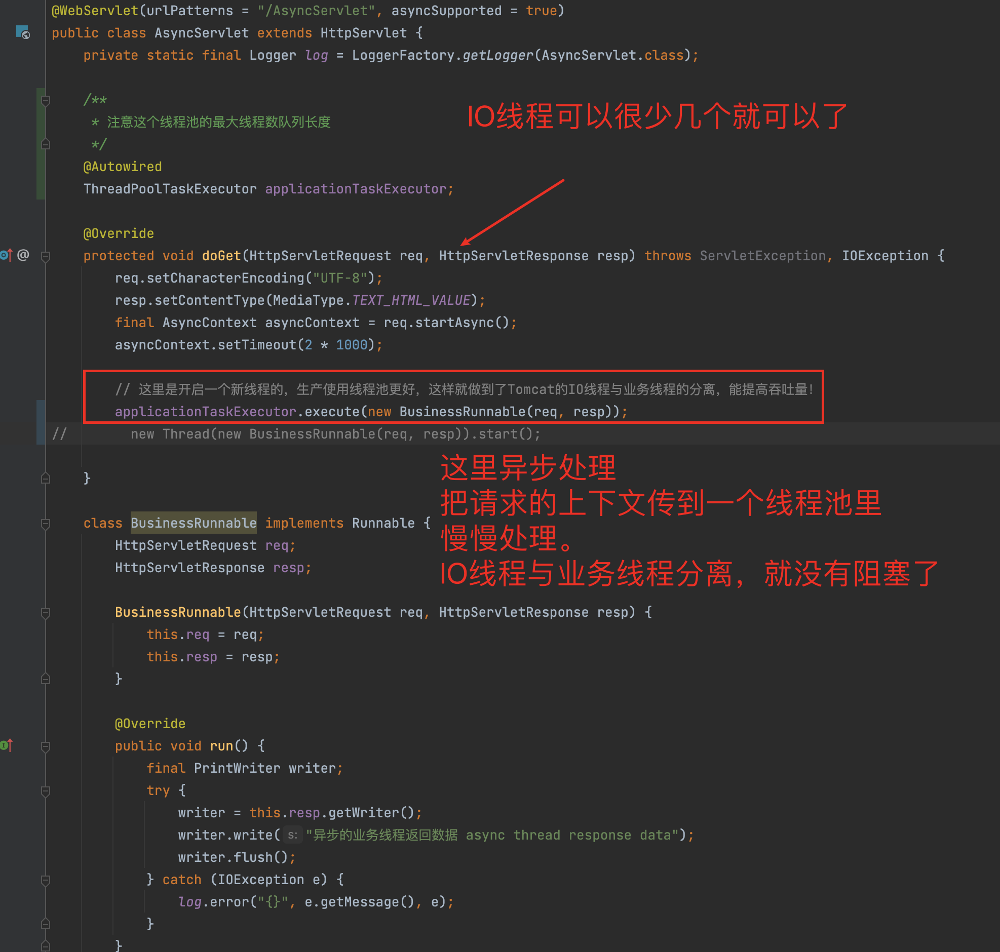
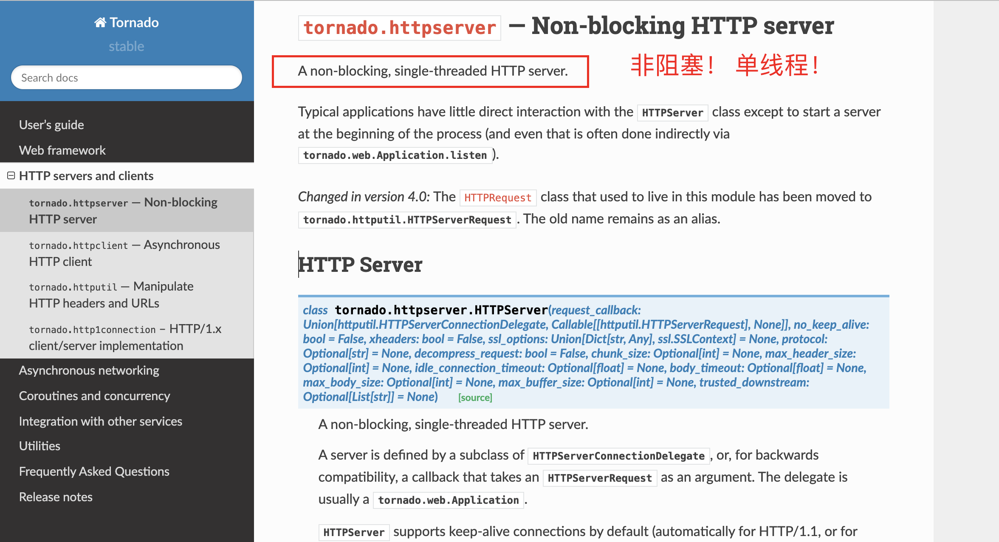

什么叫异步编程？ NIO的非阻塞又是什么意思？
==========================================

在我刚接触NIO的时候，听到了一个新的概念：非阻塞，一开始我对他的理解真的是非常的浅薄，甚至不知道歪曲到哪里去了，我一度认为 非阻塞 就是用多线程 并发执行，后来才发现我错了。

我们通常所说的异步编程 ，虽然要用到线程，~~但不是指多线程~~。举个很简单的例子，nodejs的eventloop 就不是多线程的，java的线程池 也不是， 他们都只有几个线程在那 消费队列里的任务而已，你丢进去的任务再多，都不会增加线程的数量。

异步编程一般指的是 依赖回调，nodejs里面这种东西满天都是，这也是他对外宣传的一个特点，至于NIO调用业务层需要多线程，这叫并发执行，线程与线程之间并不需要互相等待，都是并行的相互独立的业务线，每条线程内部都是同步的。

NIO的非阻塞 到底是什么意思？  举个很简单的例子，如果客户端发起一个TCP连接到服务端，BIO的做法是开启一个线程，然后读取客户端发来的数据，这么做会遇到一些问题，

- 如果客户端发起连接以后不发数据，
- 或者 因为网络原因，服务端接收数据的时候断断续续的，
- 又或者 客户端就是故意 分片发送，

这样会导致这个线程陷入阻塞，

- 当不发数据的时候服务端读不到数据所以线程阻塞在这，
- 当断断续续的时候，这个断断续续的间隔会阻塞在这得不到充分利用，

没办法最大化的利用服务器资源，所以才出现了NIO，NIO的精髓在于Selector，连接进来只会注册到Selector，当服务端收到数据了会触发一个read事件，当事件被触发以后才会读取数据，而且只读已经收到的这部分，读完就抛到协议层去处理，协议层负责将读出来的这一段段数据进行拼接，解析。当拼接到一个完整报文的时候，就会丢给业务层去处理业务逻辑，

说白了就是：连接进来的时候就一边等着去，有数据我才处理，收到多少数据就处理多少数据，处理完拉倒，不会一直停在这等客户端的。属于一种最大化利用服务器资源的手段，并不是什么黑科技。

NIO解决的只是这个问题而已，所以他叫非阻塞，**解决的是网络层的阻塞** ，不是 **业务层的阻塞** 。业务层跟什么IO都没关系，不管用什么IO，业务层都是多线程并发执行的。

本文来源：https://mp.weixin.qq.com/s/F-ZrLknnKi_Y3nxszpjDJQ

## 拓展

如何理解非阻塞和单线程！


## Tomcat的IO


BIO：阻塞式I/O操作即使用的是传统 I/O操作，Tomcat7以下版本默认情况下是以BIO模式运行的，由于每个请求都要创建一个线程来处理，线程开销较大，不能处理[高并发](https://so.csdn.net/so/search?q=高并发&spm=1001.2101.3001.7020)的场景，在三种模式中性能也最低。


NIO是[Java](https://so.csdn.net/so/search?q=Java&spm=1001.2101.3001.7020) 1.4 及后续版本提供的一种新的I/O操作方式，是一个基于缓冲区、并能提供非阻塞I/O操作的Java API，它拥有比传统I/O操作(BIO)更好的并发运行性能。tomcat 8版本及以上默认就是在NIO模式下允许。


### 非阻塞

从**用户访问角度**来看，非阻塞和阻塞并没有啥区别，都是需要服务器走完接收参数，逻辑处理，返回结果这样一个完整的流程。而且这个流程的时间并没有减少！！！

但是非阻塞对于 **服务器** 来说，可以提高服务器对客户端群体的连接数，也就是提高了服务器的并发性！[](https://)



### 单线程

单线程和多线程来说，要看程序是计算密集型还是IO密集型。如果程序是计算密集型，那么多线程这个模型里，线程计算的时间是远远大于线程切换的时间的，所以有利。

如果程序是IO密集型的，比如服务器这种网络IO的，接收客户端的网络请求。如果使用多线程去接收处理请求，那么线程执行的时间可能都没有线程切换的时间多，最后结果是线程数

虽然增加了，但是程序并发性可能并没有多大提高，反而得不偿失。相反，单线程处理IO请求的时候，没有线程的切换，所以速度反而更快。

tornado虽然是单线程的，但是处理任务还是需要多线程处理的。可以理解tornado在前端交互层的单线程处理，但是逻辑服务层还得多线程处理，两者层次不一样，所以tornado的单线程与处理任务的多线程不冲突。



### 同步、异步、阻塞、非阻塞

同步、异步是数据通信的方式，阻塞和非阻塞是一种状态。比如同步这种数据通信方式里面既可以有阻塞状态，也可以有非阻塞状态。从另一个角度理解同步和异步：使用一个线程干完的事情都是同步的，有线程切换才能干完的事情就是异步的。


#### 异步和同步

异步解决的是多个相同任务的并发性，而不是单个任务的处理时间。异步的模型里，单个任务的处理时间没有减少。只是将原来多个任务由串行变成了并行形式的处理。所以说减少了整体任务的处理时间。可以理解就是Java里面的Callable线程的处理，可以让多任务几乎同时开始处理，然后再返回结果Future一一处理。

 [一篇文章，搞懂异步和多线程的区别](https://zhuanlan.zhihu.com/p/350816301)：异步和多线程并不是一个同等关系，异步是最终目的，多线程只是实现异步的一种手段。


使用异步模型，意味着所有地方都得使用异步代码。

例如，如果微服务使用的一个请求库，但不是异步的，那么每个查询HTTP端点的请求都会阻塞事件循环，此时并不能从异步中获益。

将一个现有项目改为异步模式并不容易，因为这需要彻底修改他的设计。大多数想支持异步调用的项目都是从头设计一切的。


下面列出一些与构建微服务相关的库：

1. aiohttp.Client:可用来替换requests包。
2. aiopg:构建在Psycopg上的PostgreSQL驱动
3. aiobotocore:AWS客户端
4. aioredis:Redis客户端
5. aiomysql：Mysql客户端，基于Pymysql构建。

若找不到某些库的替代品，asyncio提供一个执行器(executor)，可用来在独立线程或进程中执行阻塞代码。这个函数是一个协同程序，底层使用concurrent模块中的ThreadPoolExecutor或者ProcessPoolExecutor类。

下面通过线程池来使用requests库：

```python
import asyncio
from concurrent.futures import ThreadPoolExecutor

import requests

"""
阻塞和非阻塞是一种过程
异步和同步是一种代码模式，模型，或者形式。
"""


# 阻塞的代码

def fetch(url: str):
    return requests.get(url).json


URLS = ['http://easyprint.vip:8080/system/info', "http://open.iciba.com/dsapi/?date=2021-05-03"]


# 非阻塞的代码 coroutine
async def example(loop):
    executor = ThreadPoolExecutor(max_workers=3)
    tasks = []
    for url in URLS:
        # 这里就是相当于java的callable线程的新建
        tasks.append(loop.run_in_executor(executor, fetch, url))
    completed, pending = await  asyncio.wait(tasks)
    for task in completed:
        print(task.result())


if __name__ == '__main__':
    loop = asyncio.get_event_loop()
    loop.run_until_complete(example(loop))
    loop.close()

```

书上原文：

《Python微服务开发》


