两个活动的并发控制
===
背景，有两个活动。一个是从数据库查询，需要很长时间。
另一个是将查询的数据进一步处理，比如调用别人的接口，所以调用速度不能太快。
目前是查询一次，处理一次，查询一次，处理一次。是完全串行的。
查询的时候也不能处理，处理的时候也没有去查询。为了节约时间同时不影响查询服务（不能多线程并发查询）和处理服务（也不能多线程并发处理）。所以需要进一步优化。其实处理的时候可以查询下一次的数据。



很明显优化后，下面的活动处理时间是第一次查询时间，加上后期所有的处理时间。比上面的要节约n-1次查询时间。

```java
 private ThreadPoolExecutor executor = new ThreadPoolExecutor(5, 10, 200, TimeUnit.MILLISECONDS,
            new LinkedBlockingQueue<Runnable>(5), new ThreadPoolExecutor.CallerRunsPolicy());

 public static void main(String args){
    CountDownLatch countDownLatch = null;
    while (true){

            List<String>  data =  select(i++); // 查询

            if(data==null||data.size==0){
                break;
            }

            try {
                if (countDownLatch != null) {
                    countDownLatch.await();
                }
                // 注意构造器的参数，表示计数器
                countDownLatch = new CountDownLatch(1);
            } catch (InterruptedException e) {
                LOGGER.error("countDownLatch error", e);
            }

            final CountDownLatch finalCountDownLatch = countDownLatch;
            executor.submit(() -> proccess(data,finalCountDownLatch));

    }
 }

 private proccess(List<String> data,CountDownLatch countDownLatch){
     try{
        // 处理data，需要控制QPS。 
     }catch(Exception e){
        LOGGER.error("data error", e);
     }finally{
        if (countDownLatch != null) {
            countDownLatch.countDown();
        }
     }
 }

```

从上面代码可以看出来就是第一次查询到数据之后没有等待，直接处理。之后每次查询完了数据，就等上次查询结果处理完成之后才能处理，保证了不影响下游服务。