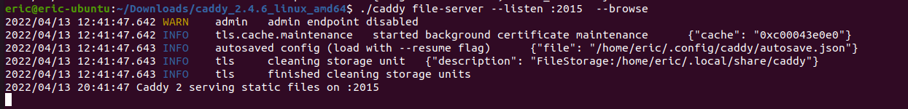
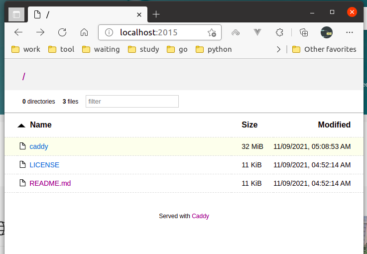
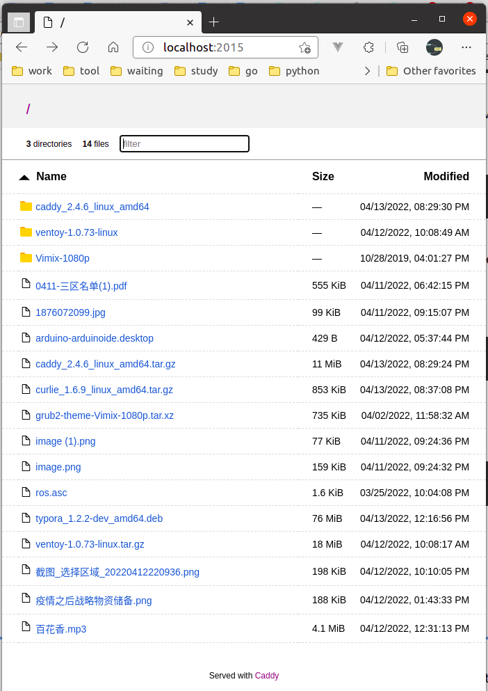

FileServer
==========


https://caddyserver.com/

caddy是一款go语言开发的对标nginx的服务器。


文件服务器参考搭建

https://caddyserver.com/docs/quick-starts/static-files

```shell
./caddy file-server --listen :2015  --browse --root ~/Downloads
```








> 但是没有找到怎么上传，应该是只能下载不能上传。有点类似镜像站的文件服务器。
