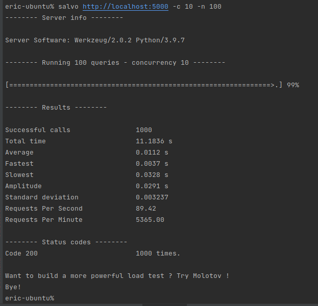

## 性能测试工具

单元测试：

功能测试：

集成测试：验证微服务如何与他的所有网络依赖项进行集成

负载测试：度量系统性能

端到端的测试：测试整个系统


### wrk

Modern HTTP benchmarking tool

https://github.com/wg/wrk


```
make -j4

cp /tmp/wrk/wrk /usr/local/bin
```


```
wrk -t12 -c400 -d30s http://127.0.0.1:8080/index.html
```

### salvo

Boom的后继者

https://github.com/tarekziade/salvo

```
pip install salvo
```


```
salvo http://localhost:5000 -c 10 -n 100
```




#### Boom（已经被salvo替换了）

Python编写的工具，它与Apache Bench等效。

https://github.com/tarekziade/boom
